# 【30天制作操作系统系列】1~4天从汇编到C语言


## 背景

30制作操作系统？这个听起来像天方夜谭，但是真有一本书就叫做《30天自制操作系统》，当然，自制操作系统的目的不是要去对标Windows、Linux、MacOS等流行的现代化操作系统，而是了解操作系统制作与运行的整个流程与细节，了解汇编与C语言。

下图是该书作者最终制作的操作系统的模样，至少我看到有图像查看器、调色板、文本阅读器与console终端，麻雀虽小五脏俱全，这张图就是我坚持的动力（笑）。

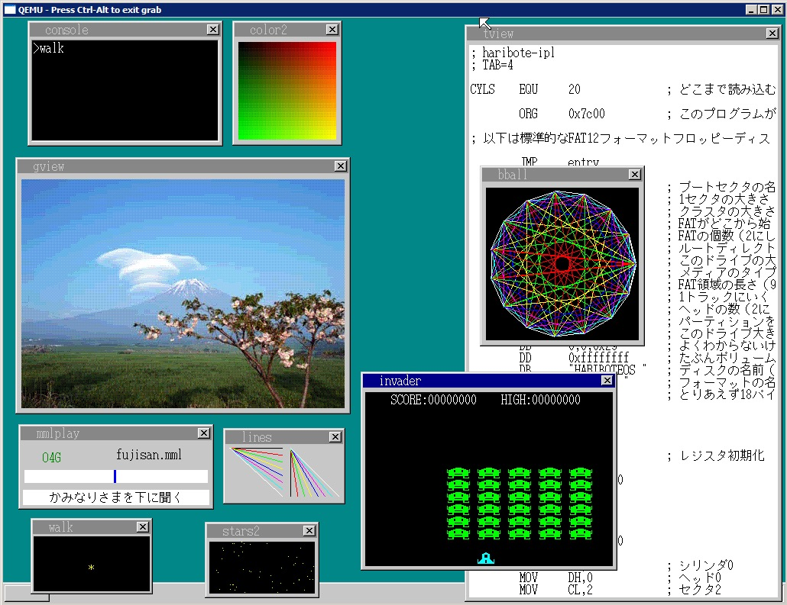

本系列文章的目的不是教你怎么一天天去实现上述操作系统，而是笔者在阅读并实践了《30天自制操作系统》一书后的一些笔记和整理，本文后面会提供该书以及所有光盘附带源码，感兴趣的读者可以自己动手实践，如果遇到不了解的内容，也可以结合本笔记查看。

操作系统，英文（Operating System，下文简称OS），是一个特殊的软件，往上运行着应用软件（比如我们常用的QQ，微信），往下和硬件打交道（比如CPU、内存、鼠标等），它就像是硬件和应用软件之间的桥梁与纽带。

仓库中包含该书以及所有源码文件：https://github.com/scriptwang/30DaysMakeOS

## 电脑启动过程

怎么才能让电脑通电后再启动我们自制的OS？首先一定要先明白电脑是怎么启动的：

1. 按下开机键通电
2. BIOS启动并自检（检查硬件设备是否就绪），新版的BIOS也叫UEFI，不要纠结，本质是一样的
3. BIOS读取硬盘/软盘/光驱的第一个扇区（512字节）到内存`0x7c00`~`0x7dff`处（`0x7dff`-`0x7c00`+`1` 刚好等于512）
4. 执行`0x7c00`~`0x7dff`代码启动相应的OS

这512字节的程序就叫做`bootloader`，在书中叫做IPL（initial program loader），叫啥不重要，总之开机就会执行这512字节的指令，这512字节的指令再去将OS kernel加载到内存，然后启动真正的OS！

如下图所示

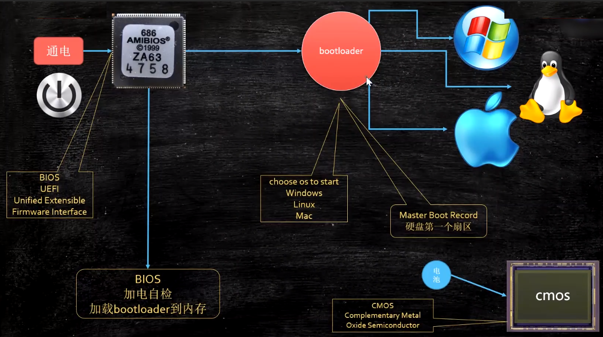

需要注意的是BIOS的一些设置信息和系统时钟信息存储在CMOS中，CMOS全称Complementary Metal Oxide Semiconductor（**互补金属氧化物半导体**），它需要通电，台式机主板上的**纽扣电池**就是给CMOS供电的，如果没电了，BIOS设置信息就会丢失然后恢复到默认值（假设设置了BIOS密码拔掉纽扣电池密码就没有啦），系统时钟也会停止

为啥有这样的设计？想一下为什么每次电脑开机时钟总是正确的？那么一定有一个地方一直在运行着，然后开机时告诉OS当前的系统时钟，要一直运行就得一直通电。

### BIOS

参考：https://zh.wikipedia.org/wiki/BIOS

BIOS（英文：Basic Input/Output System），即基本输入输出系统，BIOS是16位汇编语言程序，只能运行在**16位实模式**，可访问的内存只有1MB，而UEFI是32位或64位高级语言程序（C语言程序），突破实模式限制，可以达到要求的最大寻址。实模式的内容后面会详细讲到

> 当电脑的电源开启，BIOS就会从主板上的ROM芯片运行，运行加电自检（POST），测试和初始化CPU、RAM、直接存储器访问控制器、芯片组、键盘、软盘、硬盘等设备。当所有的Option ROM被加载后，BIOS就试图从引导设备（如硬盘、软盘、光盘）加载引导程序，由引导程序加载操作系统。BIOS也可从网卡等设备引导。

下图是BIOS自检过程中检查出的硬盘错误，这个界面有没有很熟悉的感觉。

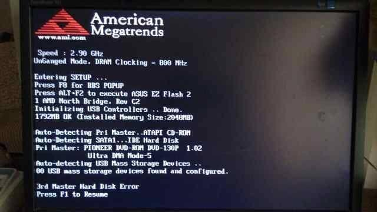

## 启动引导程序编写

启动引导程序即上文所说的512字节的`bootloader`，在书中叫做IPL，启动引导程序后文用IPL代替

### 汇编的必要性

这里讲的是用汇编来写IPL程序的必要性，编程语言那么的多，为什么要选汇编？要讲明白这个问题首先明白几个概念。

#### 机器语言

参考：https://zh.wikipedia.org/wiki/%E6%9C%BA%E5%99%A8%E8%AF%AD%E8%A8%80

> **机器语言**（machine language）是一种[指令集](https://zh.wikipedia.org/wiki/指令集)的体系。这种指令集称为**机器码**（machine code），是电脑的[CPU](https://zh.wikipedia.org/wiki/CPU)可直接解读的资料。

所谓机器语言说白了就是一堆0101...的数字，无论任何语言最终都要翻译成机器码才能被CPU执行，下面来个示例感受一下性感的机器语言

- 1011 代表赋值操作（MOV）
- 0000 代表寄存器AL
- 01100001代表数字97（十六进制表示为0x61）

所以要给寄存器AL赋值十进制数97用机器码写成

```properties
10110000 01100001
```

怎么样，性感不？任何程序最后在CPU看来都是0和1的排列组合，来看看上古时期怎么编程，就下图这玩意叫做打孔带：**带孔为1，无孔为0**，上古时期的程序就是一条条纸带，看得见，摸得着，怎么样，纸带是否更性感？


#### 汇编语言

定义

> 汇编语言（Assembly Language）是任何一种用于[电子计算机](https://baike.baidu.com/item/电子计算机/191373)、[微处理器](https://baike.baidu.com/item/微处理器/104320)、[微控制器](https://baike.baidu.com/item/微控制器/6688343)或其他可编程器件的低级语言，亦称为符号语言。
>
> 在汇编语言中，用[助记符](https://baike.baidu.com/item/助记符/489287)代替[机器指令](https://baike.baidu.com/item/机器指令/8553126)的[操作码](https://baike.baidu.com/item/操作码/3220418)，用地址符号或标号代替指令或[操作数](https://baike.baidu.com/item/操作数/7658270)的地址。
>
> 在不同的设备中，汇编语言对应着不同的机器语言[指令集](https://baike.baidu.com/item/指令集/238130)，通过汇编过程转换成机器指令。
>
> 特定的汇编语言和特定的机器语言指令集是一一对应的，不同平台之间不可直接移植。

定义很复杂，其实明白了机器码那么汇编其实很简单，汇编本质上就是机器码的**助记符**！比如上文提到的赋值操作`1011` 给它取个名儿就叫做`MOV`，`MOV`就是汇编语言，`1000` 代表寄存器AX，那么就给`1000`取个名儿叫AX，97的二进制为`01100001`，这个不好记，我们用十六进制表示成`0x61`，所以上文中性感的机器码

```properties
10110000 01100001
```

用汇编来表示就是

```assembly
MOV AL,0x61
```

有没有感觉清爽了很多？至少看到汇编能猜到大概意思，看到机器码那就一脸懵逼。

但是汇编方便了人们记忆和理解，但是不利于CPU执行啊，所以产生了将汇编助记码翻译成机器码的东西，这个东西就叫做编译器。


所以IPL程序为什么要选汇编？

CPU只认识机器码，无论什么语言最后都变成机器码才能喂给CPU，编译器就是专门干这个事情的，看看主流的编程语言是怎么被CPU执行的

- 汇编 → 机器码
- C/C++ → 汇编 → 机器码
- Java → 字节码 → JVM虚拟机（编译/解释） → 汇编 → 机器码
- ...

可以看到汇编离CPU最近（汇编本质上就是机器码的**助记符**而已），意味着**更少的依赖**以及可以操作更加底层的东西（比如直接操作CPU的寄存器）

假设用Java来编写IPL，那么它要依赖JVM虚拟机，JVM虚拟机装在哪？现在我们要制作OS，而JVM需要OS，这不就循环依赖了吗？那肯定不行！

假设用C/C++，C/C++要编译成机器码，中间也是要经过汇编的，而且很多C/C++做不到的事情还得需要汇编来做，那么为啥不直接用汇编呢？

所以经过上述分析，IPL程序用汇编编写是具有必要性的！

### CPU构成

既然讲到汇编，那就不得不提CPU的构成，如下图


CPU构成包括计算单元（ALU）、寄存器（Register）、缓存（Cache）、程序计数器（Program Counter），寄存器和缓存都是存东西的，不过寄存器更快，大概比喻如下：

寄存器就好像你房间里床边的小抽屉，比较小，但伸手就能打开，速度贼快；

缓存（特指CPU的缓存）就像你房间里的衣柜，比较大，但是要起床才能打开，速度十分快；

物理内存（就是RAM，内库条，俗称条子）就像是你房间对面的仓库，容量很大，但是你要起床，开门，再去库房，拿完东西回来再关门，速度也挺快；

硬盘就像天安门广场，很宽很大很广，可以放下很多东西，但是你得起床，出门做公交或者地铁才能到，拿完东西再回家，那速度就比你家库房（内存）拿东西慢多了。

#### 寄存器

那我们就来讲讲你房间床边的小抽屉，因为汇编里面全是对寄存器的操作，如果不清楚寄存器，会很懵

寄存器就是右边红框内的那一坨，这里展示的是32位的寄存器，寄存器都有自己的名字，所谓寄存器，简单来讲就是临时存下数据的，就像炒菜需要几个碗分别放葱姜蒜，炒的时候一股脑锅里倒就完事，那几个临时放放葱姜蒜的碗就是寄存器。

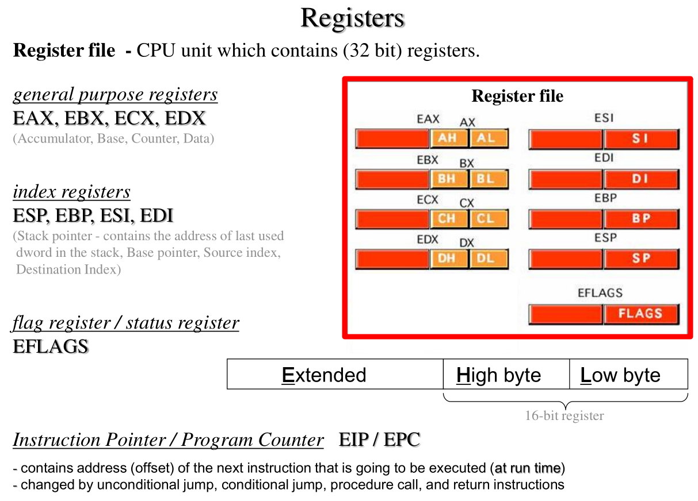

E为Extended的缩写，表示扩展；H为High的缩写，表示高位；L为Low的缩写，表示低位，例：AH表示AX寄存器的高8位

- AX、BX、CX、DX四个16位寄存器用于通用目的，比如计数、存储数据等，其实就是有4个4字节的存储空间随便取个名字叫A、B、C、D而已，然后把前8位，前8~16位，前16位分别取个个名字而已
  - AH、BH、CH、DH表示高8位
  - AL、BL、CL、DL表示低8位
  - EAX、EBX、ECX、EDX，把原来的16位扩展成32位
- SI、DI、BP、SP四个寄存器都是16位的，各有各的用途，前面加个E表示32位的
  - SI：Source Index，源变址寄存器，可以用来存放数据、地址等
  - DI：Destination Index，目的变址寄存器，可以用来存放数据、地址等
  - BP：Base Pointer，基数指针寄存器
  - SP：Stack Pointer，堆栈寄存器，存放栈的偏移地址
  - 可以看到这几个寄存器都和内存地址有关系（指针），在32位的寄存器中能表示的最大内存就是`2^32/1024/1024/1024=4GB`，所以32位系统能寻址的最大内存就是4GB，超过4GB无法使用，现在的机器一般都是64位的寄存器了，64位的可以算算`2^64/1024/1024/1024=17179869184GB=16777216TB`，就目前而言，可以算作无限大了。
- FLAGS/EFLAGS：表示当前运行状态的标识
- IP/PC：IP即Instruction Pointer，PC即Program Counter，两者其实是一个东西，程序计数器，保存的是下一条指令的执行地址

你的床边就有这么多个小抽屉，汇编就是可以直接操作这些小抽屉的

### 二/八/十六进制

虽然汇编让我们脱离了阅读机器码的苦海，但是很多时候书写内存地址等的时候依然会用到十六进制来表示（因为写二进制太长了），比如如下表示写入`0x55,0xaa`两个字节

```assembly
DB		0x55,0xaa
```

那为什么是十六进制而不是十五进制？十四进制呢？因为4个bit刚好有十六种排列组合，8个bit就是一个字节，所以两个十六进制的数就可以表示一个字节，下面是**二进制-十六进制**对照表，一般十六进制数前面有个`0x`，比如`0x45`表示十六进制的45而不是十进制的

| 二进制 | 十六进制 | 二进制 | 十六进制 | 二进制 | 十六进制 | 二进制 | 十六进制 |
| ------ | -------- | ------ | -------- | ------ | -------- | ------ | -------- |
| 0000   | 0        | 0100   | 4        | 1000   | 8        | 1100   | C        |
| 0001   | 1        | 0101   | 5        | 1001   | 9        | 1101   | D        |
| 0010   | 2        | 0110   | 6        | 1010   | A        | 1110   | E        |
| 0011   | 3        | 0111   | 7        | 1011   | B        | 1111   | F        |

八进制也是一样的道理，3个bit刚好八种排列组合，此处就不再赘述

### 最简单的启动程序

#### 汇编源码解析

首先来看书中第二天（02_day）写完的`ipl.nas`汇编文件源码，这个比较简单，书中使用的汇编编译器的nask，汇编源码需要被nask编译成机器码后才能被执行。

```assembly
; hello-os
; TAB=4

		ORG		0x7c00			; 指明程序装载地址
		JMP		entry

; 标准FAT12格式软盘专用的代码 Stand FAT12 format floppy code

		DB		0x90
		DB		"HELLOIPL"		; 启动扇区名称（8字节）
		DW		512				; 每个扇区（sector）大小（必须512字节）
		DB		1				; 簇（cluster）大小（必须为1个扇区）
		DW		1				; FAT起始位置（一般为第一个扇区）
		DB		2				; FAT个数（必须为2）
		DW		224				; 根目录大小（一般为224项）
		DW		2880			; 该磁盘大小（必须为2880扇区1440*1024/512）
		DB		0xf0			; 磁盘类型（必须为0xf0）
		DW		9				; FAT的长度（必??9扇区）
		DW		18				; 一个磁道（track）有几个扇区（必须为18）
		DW		2				; 磁头数（必??2）
		DD		0				; 不使用分区，必须是0
		DD		2880			; 重写一次磁盘大小
		DB		0,0,0x29		; 意义不明（固定）
		DD		0xffffffff		; （可能是）卷标号码
		DB		"HELLO-OS   "	; 磁盘的名称（必须为11字?，不足填空格）
		DB		"FAT12   "		; 磁盘格式名称（必??8字?，不足填空格）
		RESB	18				; 先空出18字节

; 程序主体

entry:
		MOV		AX,0			; 初始化寄存器
		MOV		SS,AX
		MOV		SP,0x7c00
		MOV		DS,AX
		MOV		ES,AX
		MOV		SI,msg
putloop:
		MOV		AL,[SI]
		ADD		SI,1			; 给SI加1
		CMP		AL,0
		JE		fin
		MOV		AH,0x0e			; 显示一个文字
		MOV		BX,15			; 指定字符颜色
		INT		0x10			; 调用显卡BIOS
		JMP		putloop
fin:
		HLT						; 让CPU停止，等待指令
		JMP		fin				; 无限循环

msg:
		DB		0x0a, 0x0a		; 换行两次
		DB		"hello, world"
		DB		0x0a			; 换行
		DB		0

		RESB	0x7dfe-$		; 填写0x00直到0x001fe

		DB		0x55, 0xaa

```

首先解释一下出现的指令

- `ORG`：origin，告诉nask，本程序被装载在`0x7c00`处，为啥是这个地方？因为BIOS默认会启动`0x7c00`~`0x7dff`处一共512字节的程序，上述汇编编译完成后一共512字节
- `DB`：data byte，意思就是此处有1个字节的内容，比如`DB 0x90`，此处有1个字节的内容是`0x90`（十六进制表示）
- `DW`：data word，意思就是此处有2个字节的内容
- `DD`：data double-word，意思就是此处有4个字节的内容
- `MOV`：move，移动的意思，但是在汇编里面就是赋值的意思，比如`MOV AX,0`相当于给寄存器AX赋值0
- `ADD`：add，做加法，`ADD SI,1`即`SI=SI+1`
- `JMP`：jump，表示跳到指定的内存地址，或者指定label，label本质也是指定地址
- `CMP`：compare，比较，`CMP AL,0`即比较AL寄存器中值是否为0
- `JE`：jump if equal，如果等于就跳转，一般配合`CMP`使用
- `INT`：interrupt，中断，中断比较复杂，后面专门会讲，此处带一下概念：中断CPU正在做的事情而去处理发出中断的事件比如鼠标移动
- `HLT`：halt，停止，意思是让CPU空闲下来，不让CPU空转
- `RESB`：reserve byte，预留字节，比如`RESB 10`表示此处往后预留10个字节，初始化为0

我们来挨个分析下上述汇编源码（汇编就是**从上往下顺序执行**的，除非遇到`JMP`等跳转指令）

- 指明本程序在内存中的装载地址，`0x7c00`这个地址是写死在BIOS里面的，相当于一个魔数，记住就行，别去纠结，不管什么操作系统BIOS肯定会去执行`0x7c00`往后的512字节的指令

```assembly
ORG		0x7c00			; 指明程序装载地址
```

- 跳转指令，跳转到label为entry的位置，标签本质上也是内存地址，不过是用标签进行了语义化，在编译完成的机器码中其实根本找不到标签的内容，这个后面详细解释

```assembly
JMP		entry
```

- 标准FAT12格式软盘专用的代码 Stand FAT12 format floppy code，FAT12格式软盘专用的代码，这一坨就是固定的，不用管

- 这便是上文中所提到的entry的位置，就是一系列赋值操作，注意最后一句`MOV SI,msg`，相当于是把标签msg的内存地址赋值给了寄存器SI，注意是标签msg的**第一条指令的内存地址**，不是msg那一坨指令

```assembly
entry:
		MOV		AX,0			; 初始化寄存器
		MOV		SS,AX
		MOV		SP,0x7c00
		MOV		DS,AX
		MOV		ES,AX
		MOV		SI,msg
```

- 注意了，这里有一个循环，功能是让BIOS在屏幕上显示一个字节的内容。`JMP putloop`就是跳转到自身，`MOV AL,[SI]`（加了中括号）表示将寄存器SI中的值当做内存地址，然后去RAM中取该地址上真正的值赋值给寄存器AL，说白了就是指针的体现

```assembly
putloop:
		MOV		AL,[SI]
		ADD		SI,1			; 给SI加1
		CMP		AL,0
		JE		fin
		MOV		AH,0x0e			; 显示一个文字
		MOV		BX,15			; 指定字符颜色
		INT		0x10			; 调用显卡BIOS
		JMP		putloop
```

这是让BIOS显示文字的指令的固定写法，不用纠结为啥`MOV AH,0x0e`和`INT 0x10`是写死的，人家BIOS就这样给你调用的，调就完事了

```assembly
MOV		AL,0x0a         ;字符代码
MOV		AH,0x0e			; 显示一个文字
MOV		BX,15			; 指定字符颜色
INT		0x10			; 调用显卡BIOS
```

- fin就不说了，是finish的意思，死循环调用`HLT`指令让CPU不空转，因为空转浪费电（笑）

```assembly
fin:
		HLT						; 让CPU停止，等待指令
		JMP		fin				; 无限循环
```

- msg就是要显示的字符，读取到0就算结束，后面的`RESB`表示要填充到512个字节，因为上面的内容远没到512字节，所以要填充，最后两个字节`0x55, 0xaa`是固定的，必须得这样写BIOS才认为是可以启动系统的！

```assembly
msg:
		DB		0x0a, 0x0a		; 换行两次
		DB		"hello, world"
		DB		0x0a			; 换行
		DB		0
		RESB	0x7dfe-$		; 填写0x00直到0x001fe
		DB		0x55, 0xaa
```

所以上面的汇编干了一件什么事？很简单，先初始化寄存器，然后调用BIOS显示msg里面的内容：`hello world`，然后HLT住CPU

#### Makefile

当然上面的汇编CPU是不认识的，需要编译成机器码，采用的是nask编译器，编译成了机器码还要生成软盘的镜像文件，作者用的是edimg工具，当然这些操作都写在Makefile里面，Makefile就是一份将源码编译成可执行文件的说明书，重点内容如下

```makefile
ipl.bin : ipl.nas Makefile
	../tolset/z_tools/nask.exe ipl.nas ipl.bin ipl.lst

helloos.img : ipl.bin Makefile
	../tolset/z_tools/edimg.exe   imgin:../tolset/z_tools/fdimg0at.tek \
		wbinimg src:ipl.bin len:512 from:0 to:0   imgout:helloos.img

```

`ipl.bin`将汇编编译成机器码二进制文件，`helloos.img`用机器码二进制文件生成软盘镜像文件

#### 虚拟机中执行

虽然作者提供了QEMU模拟器来执行，但是我更想看看在虚拟机中能跑起来不，就像在虚拟机中安装Windows那样，在Vmware中添加软盘作为启动

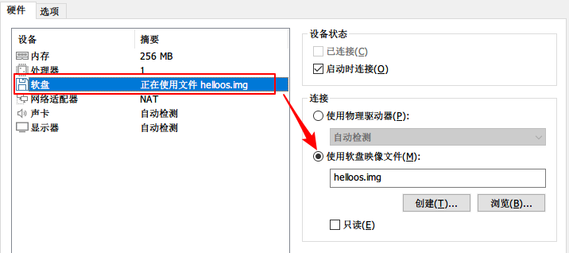

启动结果。打印出`hello, world`说明我们成功地让电脑一启动就执行我们自己的bootloader！

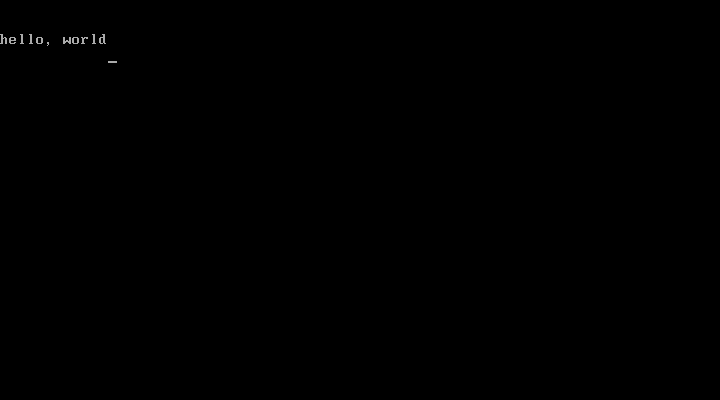

#### ipl.lst

注意在用nask编译的过程中会输出这么一个文件：ipl.lst

```bash
nask.exe ipl.nas ipl.bin ipl.lst
```

这个文件显示了一些编译的详细信息，上面的汇编编译细节如下，可以看到entry在内存的`0x7C50`处，所以`JMP entry`和`JMP 0x7C50`是等价的，编译成的结果只有2个字节`EB 4E`，`EB`指的是`JMP`指令的机器码，`4E`是十进制的78，也就是往后跳78个字节，`0x7C02` +  `0x4E`刚好就是`0x7C50`，为什么不从`0x7C00`开始算，呢？因为`JMP entry`编译成的机器码`EB 4E`占用两个字节，所以从`0x7C02`开始算

```assembly
   行号 内存地址  编译成了机器码（二进制）     源码
     1 00000000                                 ; hello-os
     2 00000000                                 ; TAB=4
     3 00000000                                 
     4                                          		ORG		0x7c00			; 指明程序装载地址
     5 00007C00 EB 4E                           		JMP		entry
     6 00007C02                                 
     7 00007C02                                 ; 标准FAT12格式软盘专用的代码 Stand FAT12 format floppy code
     8 00007C02                                 
     9 00007C02 90                              		DB		0x90
    10 00007C03 48 45 4C 4C 4F 49 50 4C         		DB		"HELLOIPL"		; 启动扇区名称（8字节）
    11 00007C0B 0200                            		DW		512				; 每个扇区（sector）大小（必须512字节）
    12 00007C0D 01                              		DB		1				; 簇（cluster）大小（必须为1个扇区）
    13 00007C0E 0001                            		DW		1				; FAT起始位置（一般为第一个扇区）
    14 00007C10 02                              		DB		2				; FAT个数（必须为2）
    15 00007C11 00E0                            		DW		224				; 根目录大小（一般为224项）
    16 00007C13 0B40                            		DW		2880			; 该磁盘大小（必须为2880扇区1440*1024/512）
    17 00007C15 F0                              		DB		0xf0			; 磁盘类型（必须为0xf0）
    18 00007C16 0009                            		DW		9				; FAT的长度（必??9扇区）
    19 00007C18 0012                            		DW		18				; 一个磁道（track）有几个扇区（必须为18）
    20 00007C1A 0002                            		DW		2				; 磁头数（必??2）
    21 00007C1C 00000000                        		DD		0				; 不使用分区，必须是0
    22 00007C20 00000B40                        		DD		2880			; 重写一次磁盘大小
    23 00007C24 00 00 29                        		DB		0,0,0x29		; 意义不明（固定）
    24 00007C27 FFFFFFFF                        		DD		0xffffffff		; （可能是）卷标号码
    25 00007C2B 48 45 4C 4C 4F 2D 4F 53 20 20   		DB		"HELLO-OS   "	; 磁盘的名称（必须为11字?，不足填空格）
       00007C35 20 
    26 00007C36 46 41 54 31 32 20 20 20         		DB		"FAT12   "		; 磁盘格式名称（必??8字?，不足填空格）
    27 00007C3E 00 00 00 00 00 00 00 00 00 00   		RESB	18				; 先空出18字节
       00007C48 00 00 00 00 00 00 00 00 
    28 00007C50                                 
    29 00007C50                                 ; 程序主体
    30 00007C50                                 
    31 00007C50                                 entry:
    32 00007C50 B8 0000                         		MOV		AX,0			; 初始化寄存器
    33 00007C53 8E D0                           		MOV		SS,AX
    34 00007C55 BC 7C00                         		MOV		SP,0x7c00
    35 00007C58 8E D8                           		MOV		DS,AX
    36 00007C5A 8E C0                           		MOV		ES,AX
    37 00007C5C BE 7C74                         		MOV		SI,msg
    38 00007C5F                                 putloop:
    39 00007C5F 8A 04                           		MOV		AL,[SI]
    40 00007C61 83 C6 01                        		ADD		SI,1			; 给SI加1
    41 00007C64 3C 00                           		CMP		AL,0
    42 00007C66 74 09                           		JE		fin
    43 00007C68 B4 0E                           		MOV		AH,0x0e			; 显示一个文字
    44 00007C6A BB 000F                         		MOV		BX,15			; 指定字符颜色
    45 00007C6D CD 10                           		INT		0x10			; 调用显卡BIOS
    46 00007C6F EB EE                           		JMP		putloop
    47 00007C71                                 fin:
    48 00007C71 F4                              		HLT						; 让CPU停止，等待指令
    49 00007C72 EB FD                           		JMP		fin				; 无限循环
    50 00007C74                                 
    51 00007C74                                 msg:
    52 00007C74 0A 0A                           		DB		0x0a, 0x0a		; 换行两次
    53 00007C76 68 65 6C 6C 6F 2C 20 77 6F 72   		DB		"hello, world"
       00007C80 6C 64 
    54 00007C82 0A                              		DB		0x0a			; 换行
    55 00007C83 00                              		DB		0
    56 00007C84                                 
    57 00007C84 00 00 00 00 00 00 00 00 00 00   		RESB	0x7dfe-$		; 填写0x00直到0x001fe
      ....省略若干个0
       00007DF6 00 00 00 00 00 00 00 00 
    58 00007DFE                                 
    59 00007DFE 55 AA                           		DB		0x55, 0xaa

```

## 从汇编到C语言

从执行汇编编写的512字节的启动程序到执行C语言，这个跨度还是挺大的，作者一开始并没有去解释这个过程，先略过了这部分，而在后面讲了GDT（Global Descriptor Table）和IDT（Interrupt Descriptor Table）再去解释的。

简而言之，整个启动过程需要经过下面步骤

1. 通过Makefile将源代码生成软盘镜像文件
2. 开机通电，插入软盘（可在虚拟机或者作者提供的虚拟环境中执行）
3. BIOS自动加载首扇区的512字节并调用其启动程序（`ipl10.nas`）
4. 启动程序将软盘内容加载到内存并跳转到指定地址执行（`ipl10.nas`）
5. 从16位实模式转换到32位保护模式（`asmhead.nas`）
6. 执行C语言入口函数（`bootpack.c`）

整个过程涉及到4个源代码文件，分别是（其中最后一个文件是汇编写的工具函数，我们以04_day里面的文件为准）

- 启动程序：`ipl10.nas`

- 转换32位保护模式程序：`asmhead.nas`

- c程序：`bootpack.c`
- 辅助功能：`naskfunc.nas`

### 内存分布图

首先看一下内存分布图，当我们需要使用内存的时候，应当避免使用到已经使用过的地方，当看到内存操作一头懵的时候，建议回来看一下这个内存分布图，下图中空白处为未使用的地方

参考：http://oswiki.osask.jp/?(AT)memorymap

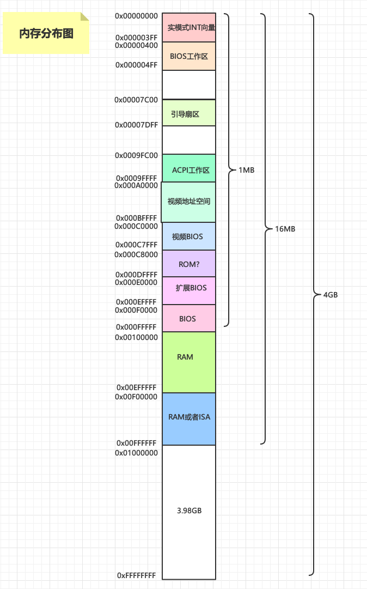

### Makefile

Makefile文件位置：`04_day/Makefile`

Makefile文件主要描述了怎么讲源代码文件组装成软盘镜像文件，整个过程如下所示，红色方框是源代码文件

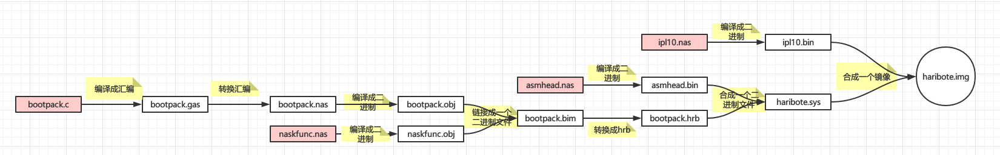

可见C语言要编译成可执行的二进制代码要进过的步骤最多，会产生大量的中间文件，注意最后的二进制文件中`haribote.sys`其实包含了`asmhead.nas`，`bootpack.c`、`naskfunc.nas`的内容，内容顺序是从左往右。

### 软盘内容加载到内存

这是启动程序`ipl10.nas`做的事情，涉及到的汇编代码如下，此时还是在BIOS的16位实模式（后面会详细说）下，可以通过调用BIOS提供的中断函数（`INT 0x13`）进行软盘读取，其中涉及到软盘的柱面，磁头，扇区等概念直接看书上的解释就好，此处不再赘述

```assembly
; 读取磁盘

		MOV		AX,0x0820
		MOV		ES,AX
		MOV		CH,0			; 柱面0
		MOV		DH,0			; 磁头0
		MOV		CL,2			; 扇区2（排除了启动扇区）

readloop:
		MOV		SI,0			; 记录失败次数寄存器

;...省略
```

那么这段程序将软盘的内容装载到了什么地方？

```assembly
MOV		AX,0x0820
...
MOV		BX,0
```

着重看这两句，装载软盘内容的物理起始地址为`0x0820 * 0x10=0x8200`处（此处计算方式可以参考后面16位实模式的讲解），装载了8704字节（排除了启动扇区的512字节），所以结束地址为`0x8200+0x2200-1=0xA3FF`

### 跳转到加载地址执行

这段代码仍然在`ipl10.nas`中，因为刚才装载了软盘的内容，现在要执行装载的内容：`haribote.sys`，它在内存中的位置是`0xc200`，那么是怎么确定这个位置的呢？

```assembly
; 读取完毕，跳转到haribote.sys执行！
		MOV		[0x0ff0],CH		; IPLがどこまで読んだのかをメモ
		JMP		0xc200
```

很简单，一般向一个空软盘保存文件时，文件名会写在`0x002600`以后的地方，文件内容会写在`0x004200`以后的地方，我们来验证下，将十六进制编辑器打开最终生成的`haribote.img`文件

- 文件名

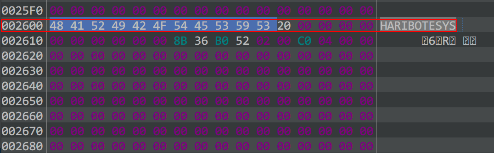

- 文件内容

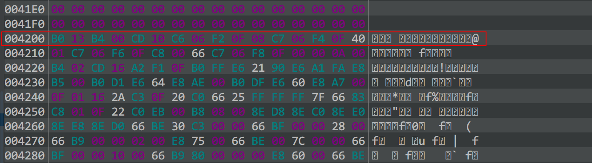

先确定`haribote.sys`文件第一条指令所在的位置（绝对位置），再加上装载在内存中的起始位置`0x8200`就行了。绝对位置为：`0x004200`，所以`0x4200 + 0x8200 - 0x200 = 0xC200`，之所以要减去`0x200`是因为绝对位置包括了启动扇区的512字节，所以要减掉

### 转换到32位保护模式

目前为止一直在都是使用的16位实模式在运行，该模式只支持1MB内存并且访问的是物理内存的真实地址，该模式只适用于一些引导系统的基本操作，比如上述的读取软盘到内存等，我们自制制作OS当然要转换成32位保护模式。

在转换之前，先了解下什么是实模式，什么是保护模式

#### 实模式与保护模式

准确的说是16位实模式和32位保护模式，此处的所谓模式，指的是CPU的工作模式，体现在CPU的寻址方式和寄存器的大小

#### 16位实模式

实模式出现于早期x86 CPU时期，一共只有20位地址线（能使用的内存空间只有`2^20/1024/1024=1MB`，在这1MB内存中，前640K称为基本内存，后面384K内存留给开机必要硬件和各类BIOS本身使用），以及8个16位的通用寄存器和4个16位段寄存器，所以叫做16位实模式。

在x86系列处理器进入32位的时代，由于兼容性的原因，新的处理器（[80386](https://zh.wikipedia.org/wiki/80386)）保留16位的运行方式（[实模式](https://zh.wikipedia.org/wiki/实模式)），此后多次处理器的升级换代都保留这种运行方式。甚至在包含[EM64T](https://zh.wikipedia.org/wiki/EM64T)技术的[至强](https://zh.wikipedia.org/wiki/至强)系列处理器中，处理器加电启动时仍然会切换到16位的实模式下运行BIOS。

##### 寻址方式

16位实模式是怎么寻址的呢？因为总线有20位，能表示1M的内存空间，而段寄存器又是16位的，只有64K的寻址能力，怎么用16位的段寄存器来寻址20位的内存空间呢？答案就是分段寻址（所以用于寻址的寄存器也叫段寄存器）。所谓分段就是将1M的内存空间划分为16段，每段64KB（刚好能被16位表示完），一共就是16*64KB=1MB，然后计算物理地址的时候采用如下公式（16的十六进制为0x10）

- 十进制

```properties
物理地址 = 段基址 * 16 + 段内偏移地址
```

- 十六进制

```properties
物理地址 = 段基址 * 0x10 + 段内偏移地址
```

如下图所示

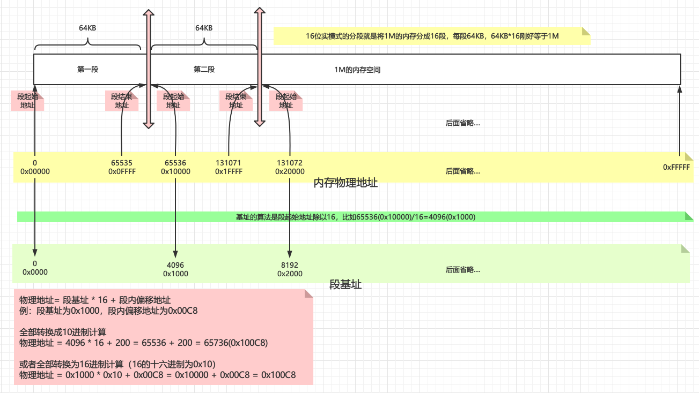

1. 将内存分段（将1M的内存分成16段，每段64KB，64KB*16刚好等于1M）

2. 得到每段的起始物理地址和结束物理地址，比如第一段的结束地址为`0x0FFFF`，第二段的开始地址为`0x10000`

3. 将每段的起始地址除以0x16得到每段的段基址（为啥要除以`0x16`？因为寄存器只有16位，内存地址有20位，除以`0x16`相当于少了一位，比如`0x10000 / 0x16 = 0x1000`，注意计算是用16进制的）

例：段基址为`0x1000`，段内偏移地址为`0x00C8`，物理地址 = `0x1000` * `0x16` + `0x00C8` = `0x10000` + `0x00C8` = `0x100C8`

其本质的思想也是分而治之，有没有找到一点Java中`HashMap`的感觉？

在这种模式下，最终计算和操作的都是内存的物理地址，是真真正正存在的，所以这也是**实模式**这个名字的由来，实就表示真实物理地址。其实这种模式下是不安全的，因为程序可以随意访问整个内存空间！

#### 32位保护模式

随着CPU的发展，CPU的地址线的个数也从原来的20根变为现在的32根，所以可以访问的内存空间也从1MB变为现在4GB，寄存器的位数也变为32位，所以叫做32位保护模式。

> **保护模式**（英语：Protected Mode，或有时简写为 pmode）是一种[80286](https://zh.wikipedia.org/wiki/80286)系列和之后的[x86](https://zh.wikipedia.org/wiki/X86)兼容[CPU](https://zh.wikipedia.org/wiki/CPU)的运行模式。保护模式有一些新的特性，如[存储器保护](https://zh.wikipedia.org/wiki/記憶體保護)，[标签页](https://zh.wikipedia.org/wiki/分頁)系统以及硬件支持的[虚拟内存](https://zh.wikipedia.org/wiki/虚拟内存)，能够增强[多任务处理](https://zh.wikipedia.org/wiki/多任务处理)和系统稳定度。现今大部分的x86[操作系统](https://zh.wikipedia.org/wiki/作業系統)都在保护模式下运行，包含[Linux](https://zh.wikipedia.org/wiki/Linux)、[FreeBSD](https://zh.wikipedia.org/wiki/FreeBSD)、以及[微软](https://zh.wikipedia.org/wiki/微軟)[Windows 2.0](https://zh.wikipedia.org/wiki/Windows_2.0)和之后版本。

##### 寻址方式

现在的情况是CPU的总线是32根，能支持到4GB内存，但是为了兼容性，段寄存器仍然是16位的，所以怎么用16位的段寄存器表示高达4GB的内存空间呢？

实模式下，段值（段地址的值）还是地址的一部分。在保护模式下，虽然段值仍然由原来的**16位**的CS、DS等寄存器表示，但是此时它们仅仅是一个索引，这些个索引**指向一个数据结构的表项**，表项中详细定义了一个段的起始地址、界限、属性等内容，这个数据结构，叫做**GDT**（Global Descriptor Table），GDT中的每一个表项，叫做**描述符**

每个段8字节，段里包含的内容有

- 段的大小
- 段的起始地址
- 段的管理属性：禁止写入，禁止执行，系统专用等（完全可以将某些段设置为系统专用，这样在CPU层面禁止恶意程序访问，保护了系统，这也是保护模式中**保护**二字的含义）

16位的段寄存器低3位是不能使用的（存储了其他信息），只有高13位能使用，所以能表示0~8191的数，也就是说能表示8192个段，每个段对于应用程序而言地址都是从0开始，这也解决了多应用程序同时访问同一个物理地址的冲突问题（相当于虚拟地址）

说白了其实就是存了一张内存分段信息表，通过这张信息表做转换达到表示4GB内存的目的，具体寻址过程如下图

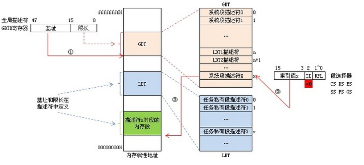

1. 寻址时，先找到GTDR寄存器，从中得到GDT的基址（GTDR寄存器是专门告诉CPU GDT数据在哪里的寄存器）
2. 有了GDT的基址，又有段寄存器中保存的索引，可以得到段寄存器“所指”的那个表项，既所指的那个描述符
3. 得到了描述符，就可以从描述符中得到该描述符所描述的那个段的起始地址
4. 有了段的起始地址，将偏移地址拿过来与之相加，便能得到最后的**线性地址**
5. 有了线性地址（虚拟地址），经过变换，即可得到相应的物理地址

#### 模式转换

转换过程主要在`asmhead.nas`文件中，其主要流程是

1. 关闭所有中断请求（中断的概念后文会解释），防止转换过程中被打断
2. 指明指令集：`[INSTRSET "i486p"]`
3. 设置临时GDT：`LGDT [GDTR0]`，作者设置临时GDT的目的是在尽量避免在汇编中写复杂的代码，后面在C中还会设置一次GDT
4. 接下来就是一系列拷贝操作（`memcpy`），因为现在是32位模式了，要把之前加载到1MB以内内存位置的内容重新分配一下
5. 最后启动`bootpack`，因为`bootpack.c`编译后形成的二进制代码拼接在`asmhead.nas`的后面的，所以会直接执行

最终内存分布如下所示，可以对照内存分布图可以看到除了BIOS的1MB之外的内容主要分布在`0x00100000`~`0x00EFFFFF`之间（RAM）

```properties
0x00000000 - 0x000fffff : 虽然在启动中会多次使用，但之后就变空。（1MB）
0x00100000 - 0x00267fff : 用于保存软盘的内容。（1440KB）
0x00268000 - 0x0026f7ff : 空（30KB）
0x0026f800 - 0x0026ffff : IDT （2KB）
0x00270000 - 0x0027ffff : GDT （64KB）
0x00280000 - 0x002fffff : bootpack.hrb（512KB）
0x00300000 - 0x003fffff : 栈及其他（1MB）
0x00400000 - : 空
```


### 调用C语言

首先看一下最简单的C语言代码，`HariMain`为主函数，因为编译器是作者改过的GCC编译器，他将主函数改成了HariMain，不过这个不影响。这段代码通过编译后会拼接在`asmhead.nas`的`bootpack:`的后面，所以执行完模式转换代码后就开始执行C语言的代码！

```c
void io_hlt(void);
void write_mem8(int addr, int data);

void HariMain(void)
{
	int i; /* 変数宣言。iという変数は、32ビットの整数型 */

	for (i = 0xa0000; i <= 0xaffff; i++) {
		write_mem8(i, 15); /* MOV BYTE [i],15 */
	}

	for (;;) {
		io_hlt();
	}
}

```

`0xa0000`到`0xaffff`是表示视频的内存地址，详情可以看内存分布图，上面这段代码会在屏幕上显示白色，然后调用`io_hlt`无限等待

`io_hlt`是写在了`naskfunc.nas`中，这里相当于是C语言中调用了汇编，在C语言完成不了的时候可以使用汇编辅助

```assembly
_io_hlt:	; void io_hlt(void);
		HLT
		RET
```

#### 指针

`write_mem8`函数也是用汇编来写的：先读四字节（第一个参数）到ECX寄存器，然后再读四字节（第二个参数）到AL寄存器，然后将AL的寄存器里的值赋值到ECX寄存器所代表的内存地址中，这就是C语言中指针的本质。

```assembly
_write_mem8:	; void write_mem8(int addr, int data);
		MOV		ECX,[ESP+4]		; [ESP+4]にaddrが入っているのでそれをECXに読み込む
		MOV		AL,[ESP+8]		; [ESP+8]にdataが入っているのでそれをALに読み込む
		MOV		[ECX],AL
		RET
```


## OS启动效果图

这是第四天的效果图，完成了32位保护模式的转换以及C语言的调用，并可以在屏幕上画带颜色的矩形。

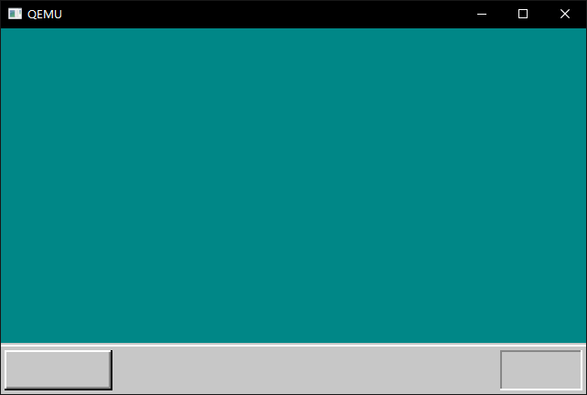

## 代码清单

以04_day为准

### `ipl10.nas`

```assembly
; haribote-ipl
; TAB=4

CYLS	EQU		10				; 声明CYLS=10

		ORG		0x7c00			; 指明程序装载地址

; 标准FAT12格式软盘专用的代码 Stand FAT12 format floppy code

		JMP		entry
		DB		0x90
		DB		"HARIBOTE"		; 启动扇区名称（8字节）
		DW		512				; 每个扇区（sector）大小（必须512字节）
		DB		1				; 簇（cluster）大小（必须为1个扇区）
		DW		1				; FAT起始位置（一般为第一个扇区）
		DB		2				; FAT个数（必须为2）
		DW		224				; 根目录大小（一般为224项）
		DW		2880			; 该磁盘大小（必须为2880扇区1440*1024/512）
		DB		0xf0			; 磁盘类型（必须为0xf0）
		DW		9				; FAT的长度（必??9扇区）
		DW		18				; 一个磁道（track）有几个扇区（必须为18）
		DW		2				; 磁头数（必??2）
		DD		0				; 不使用分区，必须是0
		DD		2880			; 重写一次磁盘大小
		DB		0,0,0x29		; 意义不明（固定）
		DD		0xffffffff		; （可能是）卷标号码
		DB		"HARIBOTEOS "	; 磁盘的名称（必须为11字?，不足填空格）
		DB		"FAT12   "		; 磁盘格式名称（必??8字?，不足填空格）
		RESB	18				; 先空出18字节

; 程序主体

entry:
		MOV		AX,0			; 初始化寄存器
		MOV		SS,AX
		MOV		SP,0x7c00
		MOV		DS,AX

; 读取磁盘

		MOV		AX,0x0820
		MOV		ES,AX
		MOV		CH,0			; 柱面0
		MOV		DH,0			; 磁头0
		MOV		CL,2			; 扇区2

readloop:
		MOV		SI,0			; 记录失败次数寄存器

retry:
		MOV		AH,0x02			; AH=0x02 : 读入磁盘
		MOV		AL,1			; 1个扇区
		MOV		BX,0
		MOV		DL,0x00			; A驱动器
		INT		0x13			; 调用磁盘BIOS
		JNC		next			; 没出错则跳转到fin
		ADD		SI,1			; 往SI加1
		CMP		SI,5			; 比较SI与5
		JAE		error			; SI >= 5 跳转到error
		MOV		AH,0x00
		MOV		DL,0x00			; A驱动器
		INT		0x13			; 重置驱动器
		JMP		retry
next:
		MOV		AX,ES			; 把内存地址后移0x200（512/16十六进制转换）
		ADD		AX,0x0020
		MOV		ES,AX			; ADD ES,0x020因为没有ADD ES，只能通过AX进行
		ADD		CL,1			; 往CL里面加1
		CMP		CL,18			; 比较CL与18
		JBE		readloop		; CL <= 18 跳转到readloop
		MOV		CL,1
		ADD		DH,1
		CMP		DH,2
		JB		readloop		; DH < 2 跳转到readloop
		MOV		DH,0
		ADD		CH,1
		CMP		CH,CYLS
		JB		readloop		; CH < CYLS 跳转到readloop

; 读取完毕，跳转到haribote.sys执行！
		MOV		[0x0ff0],CH		; IPLがどこまで読んだのかをメモ
		JMP		0xc200

error:
		MOV		SI,msg

putloop:
		MOV		AL,[SI]
		ADD		SI,1			; 给SI加1
		CMP		AL,0
		JE		fin
		MOV		AH,0x0e			; 显示一个文字
		MOV		BX,15			; 指定字符颜色
		INT		0x10			; 调用显卡BIOS
		JMP		putloop

fin:
		HLT						; 让CPU停止，等待指令
		JMP		fin				; 无限循环

msg:
		DB		0x0a, 0x0a		; 换行两次
		DB		"load error"
		DB		0x0a			; 换行
		DB		0

		RESB	0x7dfe-$		; 填写0x00直到0x001fe

		DB		0x55, 0xaa

```


### `asmhead.nas`

```assembly
; haribote-os boot asm
; TAB=4

BOTPAK	EQU		0x00280000		; 加载bootpack
DSKCAC	EQU		0x00100000		; 磁盘缓存的位置
DSKCAC0	EQU		0x00008000		; 磁盘缓存的位置（实模式）

; BOOT_INFO相关
CYLS	EQU		0x0ff0			; 引导扇区设置
LEDS	EQU		0x0ff1
VMODE	EQU		0x0ff2			; 关于颜色的信息
SCRNX	EQU		0x0ff4			; 分辨率X
SCRNY	EQU		0x0ff6			; 分辨率Y
VRAM	EQU		0x0ff8			; 图像缓冲区的起始地址

		ORG		0xc200			;  这个的程序要被装载的内存地址

; 画面モードを設定

		MOV		AL,0x13			; VGA显卡，320x200x8bit
		MOV		AH,0x00
		INT		0x10
		MOV		BYTE [VMODE],8	; 屏幕的模式（参考C语言的引用）
		MOV		WORD [SCRNX],320
		MOV		WORD [SCRNY],200
		MOV		DWORD [VRAM],0x000a0000

; 通过BIOS获取指示灯状态

		MOV		AH,0x02
		INT		0x16 			; keyboard BIOS
		MOV		[LEDS],AL

; 防止PIC接受所有中断
;	AT兼容机的规范、PIC初始化
;	然后之前在CLI不做任何事就挂起
;	PIC在同意后初始化

		MOV		AL,0xff
		OUT		0x21,AL
		NOP						; 不断执行OUT指令
		OUT		0xa1,AL

		CLI						; 进一步中断CPU

; 让CPU支持1M以上内存、设置A20GATE

		CALL	waitkbdout
		MOV		AL,0xd1
		OUT		0x64,AL
		CALL	waitkbdout
		MOV		AL,0xdf			; enable A20
		OUT		0x60,AL
		CALL	waitkbdout

; 保护模式转换

[INSTRSET "i486p"]				; 说明使用486指令

		LGDT	[GDTR0]			; 设置临时GDT
		MOV		EAX,CR0
		AND		EAX,0x7fffffff	; 使用bit31（禁用分页）
		OR		EAX,0x00000001	; bit0到1转换（保护模式过渡）
		MOV		CR0,EAX
		JMP		pipelineflush
pipelineflush:
		MOV		AX,1*8			;  写32bit的段
		MOV		DS,AX
		MOV		ES,AX
		MOV		FS,AX
		MOV		GS,AX
		MOV		SS,AX

; bootpack传递

		MOV		ESI,bootpack	; 源
		MOV		EDI,BOTPAK		; 目标
		MOV		ECX,512*1024/4
		CALL	memcpy

; 传输磁盘数据

; 从引导区开始

		MOV		ESI,0x7c00		; 源
		MOV		EDI,DSKCAC		; 目标
		MOV		ECX,512/4
		CALL	memcpy

; 剩余的全部

		MOV		ESI,DSKCAC0+512	; 源
		MOV		EDI,DSKCAC+512	; 目标
		MOV		ECX,0
		MOV		CL,BYTE [CYLS]
		IMUL	ECX,512*18*2/4	; 除以4得到字节数
		SUB		ECX,512/4		; IPL偏移量
		CALL	memcpy

; 由于还需要asmhead才能完成
; 完成其余的bootpack任务

; bootpack启动

		MOV		EBX,BOTPAK
		MOV		ECX,[EBX+16]
		ADD		ECX,3			; ECX += 3;
		SHR		ECX,2			; ECX /= 4;
		JZ		skip			; 传输完成
		MOV		ESI,[EBX+20]	; 源
		ADD		ESI,EBX
		MOV		EDI,[EBX+12]	; 目标
		CALL	memcpy
skip:
		MOV		ESP,[EBX+12]	; 堆栈的初始化
		JMP		DWORD 2*8:0x0000001b

waitkbdout:
		IN		 AL,0x64
		AND		 AL,0x02
		JNZ		waitkbdout		; AND结果不为0跳转到waitkbdout
		RET

memcpy:
		MOV		EAX,[ESI]
		ADD		ESI,4
		MOV		[EDI],EAX
		ADD		EDI,4
		SUB		ECX,1
		JNZ		memcpy			; 运算结果不为0跳转到memcpy
		RET
; memcpy地址前缀大小

		ALIGNB	16
GDT0:
		RESB	8				; 初始值
		DW		0xffff,0x0000,0x9200,0x00cf	; 写32bit位段寄存器
		DW		0xffff,0x0000,0x9a28,0x0047	; 可执行的文件的32bit寄存器（bootpack用）

		DW		0
GDTR0:
		DW		8*3-1
		DD		GDT0

		ALIGNB	16
bootpack:

```


### `naskfunc.nas`

```assembly
; naskfunc
; TAB=4

[FORMAT "WCOFF"]				; 制作目标文件的模式	
[INSTRSET "i486p"]				; 使用到486为止的指令
[BITS 32]						; 3制作32位模式用的机器语言
[FILE "naskfunc.nas"]			; 文件名

		GLOBAL	_io_hlt, _io_cli, _io_sti, _io_stihlt
		GLOBAL	_io_in8,  _io_in16,  _io_in32
		GLOBAL	_io_out8, _io_out16, _io_out32
		GLOBAL	_io_load_eflags, _io_store_eflags

[SECTION .text]

_io_hlt:	; void io_hlt(void);
		HLT
		RET

_io_cli:	; void io_cli(void);
		CLI
		RET

_io_sti:	; void io_sti(void);
		STI
		RET

_io_stihlt:	; void io_stihlt(void);
		STI
		HLT
		RET

_io_in8:	; int io_in8(int port);
		MOV		EDX,[ESP+4]		; port
		MOV		EAX,0
		IN		AL,DX
		RET

_io_in16:	; int io_in16(int port);
		MOV		EDX,[ESP+4]		; port
		MOV		EAX,0
		IN		AX,DX
		RET

_io_in32:	; int io_in32(int port);
		MOV		EDX,[ESP+4]		; port
		IN		EAX,DX
		RET

_io_out8:	; void io_out8(int port, int data);
		MOV		EDX,[ESP+4]		; port
		MOV		AL,[ESP+8]		; data
		OUT		DX,AL
		RET

_io_out16:	; void io_out16(int port, int data);
		MOV		EDX,[ESP+4]		; port
		MOV		EAX,[ESP+8]		; data
		OUT		DX,AX
		RET

_io_out32:	; void io_out32(int port, int data);
		MOV		EDX,[ESP+4]		; port
		MOV		EAX,[ESP+8]		; data
		OUT		DX,EAX
		RET

_io_load_eflags:	; int io_load_eflags(void);
		PUSHFD		; PUSH EFLAGS 
		POP		EAX
		RET

_io_store_eflags:	; void io_store_eflags(int eflags);
		MOV		EAX,[ESP+4]
		PUSH	EAX
		POPFD		; POP EFLAGS 
		RET

```

### `bootpack.c`

```c
void io_hlt(void);
void io_cli(void);
void io_out8(int port, int data);
int io_load_eflags(void);
void io_store_eflags(int eflags);

void init_palette(void);
void set_palette(int start, int end, unsigned char *rgb);
void boxfill8(unsigned char *vram, int xsize, unsigned char c, int x0, int y0, int x1, int y1);

#define COL8_000000		0
#define COL8_FF0000		1
#define COL8_00FF00		2
#define COL8_FFFF00		3
#define COL8_0000FF		4
#define COL8_FF00FF		5
#define COL8_00FFFF		6
#define COL8_FFFFFF		7
#define COL8_C6C6C6		8
#define COL8_840000		9
#define COL8_008400		10
#define COL8_848400		11
#define COL8_000084		12
#define COL8_840084		13
#define COL8_008484		14
#define COL8_848484		15

void HariMain(void)
{
	char *vram;/* 声明变量vram、用于BYTE [...]地址 */
	int xsize, ysize;

	init_palette();/* 设定调色板 */
	vram = (char *) 0xa0000;/* 地址变量赋值 */
	xsize = 320;
	ysize = 200;

	/* 根据 0xa0000 + x + y * 320 计算坐标 8*/
	boxfill8(vram, xsize, COL8_008484,  0,         0,          xsize -  1, ysize - 29);
	boxfill8(vram, xsize, COL8_C6C6C6,  0,         ysize - 28, xsize -  1, ysize - 28);
	boxfill8(vram, xsize, COL8_FFFFFF,  0,         ysize - 27, xsize -  1, ysize - 27);
	boxfill8(vram, xsize, COL8_C6C6C6,  0,         ysize - 26, xsize -  1, ysize -  1);

	boxfill8(vram, xsize, COL8_FFFFFF,  3,         ysize - 24, 59,         ysize - 24);
	boxfill8(vram, xsize, COL8_FFFFFF,  2,         ysize - 24,  2,         ysize -  4);
	boxfill8(vram, xsize, COL8_848484,  3,         ysize -  4, 59,         ysize -  4);
	boxfill8(vram, xsize, COL8_848484, 59,         ysize - 23, 59,         ysize -  5);
	boxfill8(vram, xsize, COL8_000000,  2,         ysize -  3, 59,         ysize -  3);
	boxfill8(vram, xsize, COL8_000000, 60,         ysize - 24, 60,         ysize -  3);

	boxfill8(vram, xsize, COL8_848484, xsize - 47, ysize - 24, xsize -  4, ysize - 24);
	boxfill8(vram, xsize, COL8_848484, xsize - 47, ysize - 23, xsize - 47, ysize -  4);
	boxfill8(vram, xsize, COL8_FFFFFF, xsize - 47, ysize -  3, xsize -  4, ysize -  3);
	boxfill8(vram, xsize, COL8_FFFFFF, xsize -  3, ysize - 24, xsize -  3, ysize -  3);

	for (;;) {
		io_hlt();
	}
}

void init_palette(void)
{
	static unsigned char table_rgb[16 * 3] = {
		0x00, 0x00, 0x00,	/*  0:黑 */
		0xff, 0x00, 0x00,	/*  1:梁红 */
		0x00, 0xff, 0x00,	/*  2:亮绿 */
		0xff, 0xff, 0x00,	/*  3:亮黄 */
		0x00, 0x00, 0xff,	/*  4:亮蓝 */
		0xff, 0x00, 0xff,	/*  5:亮紫 */
		0x00, 0xff, 0xff,	/*  6:浅亮蓝 */
		0xff, 0xff, 0xff,	/*  7:白 */
		0xc6, 0xc6, 0xc6,	/*  8:亮灰 */
		0x84, 0x00, 0x00,	/*  9:暗红 */
		0x00, 0x84, 0x00,	/* 10:暗绿 */
		0x84, 0x84, 0x00,	/* 11:暗黄 */
		0x00, 0x00, 0x84,	/* 12:暗青 */
		0x84, 0x00, 0x84,	/* 13:暗紫 */
		0x00, 0x84, 0x84,	/* 14:浅暗蓝 */
		0x84, 0x84, 0x84	/* 15:暗灰 */
	};
	set_palette(0, 15, table_rgb);
	return;

	/* C语言中的static char语句只能用于数据，相当于汇编中的DB指令 */
}

void set_palette(int start, int end, unsigned char *rgb)
{
	int i, eflags;
	eflags = io_load_eflags();	/* 记录中断许可标志的值 */
	io_cli(); 					/* 将中断许可标志置为0,禁止中断 */
	io_out8(0x03c8, start);
	for (i = start; i <= end; i++) {
		io_out8(0x03c9, rgb[0] / 4);
		io_out8(0x03c9, rgb[1] / 4);
		io_out8(0x03c9, rgb[2] / 4);
		rgb += 3;
	}
	io_store_eflags(eflags);	/* 复原中断许可标志 */
	return;
}

void boxfill8(unsigned char *vram, int xsize, unsigned char c, int x0, int y0, int x1, int y1)
{
	int x, y;
	for (y = y0; y <= y1; y++) {
		for (x = x0; x <= x1; x++)
			vram[y * xsize + x] = c;
	}
	return;
}
```

### `Makefile`

```makefile
TOOLPATH = ../tolset/z_tools/
INCPATH  = ../tolset/z_tools/haribote/

MAKE     = $(TOOLPATH)make.exe -r
NASK     = $(TOOLPATH)nask.exe
CC1      = $(TOOLPATH)cc1.exe -I$(INCPATH) -Os -Wall -quiet
GAS2NASK = $(TOOLPATH)gas2nask.exe -a
OBJ2BIM  = $(TOOLPATH)obj2bim.exe
BIM2HRB  = $(TOOLPATH)bim2hrb.exe
RULEFILE = $(TOOLPATH)haribote/haribote.rul
EDIMG    = $(TOOLPATH)edimg.exe
IMGTOL   = $(TOOLPATH)imgtol.com
COPY     = copy
DEL      = del

# 默认动作

default :
	$(MAKE) img

# 镜像文件生成

ipl10.bin : ipl10.nas Makefile
	$(NASK) ipl10.nas ipl10.bin ipl10.lst

asmhead.bin : asmhead.nas Makefile
	$(NASK) asmhead.nas asmhead.bin asmhead.lst

bootpack.gas : bootpack.c Makefile
	$(CC1) -o bootpack.gas bootpack.c

bootpack.nas : bootpack.gas Makefile
	$(GAS2NASK) bootpack.gas bootpack.nas

bootpack.obj : bootpack.nas Makefile
	$(NASK) bootpack.nas bootpack.obj bootpack.lst

naskfunc.obj : naskfunc.nas Makefile
	$(NASK) naskfunc.nas naskfunc.obj naskfunc.lst

bootpack.bim : bootpack.obj naskfunc.obj Makefile
	$(OBJ2BIM) @$(RULEFILE) out:bootpack.bim stack:3136k map:bootpack.map \
		bootpack.obj naskfunc.obj
# 3MB+64KB=3136KB

bootpack.hrb : bootpack.bim Makefile
	$(BIM2HRB) bootpack.bim bootpack.hrb 0

haribote.sys : asmhead.bin bootpack.hrb Makefile
	copy /B asmhead.bin+bootpack.hrb haribote.sys

haribote.img : ipl10.bin haribote.sys Makefile
	$(EDIMG)   imgin:../tolset/z_tools/fdimg0at.tek \
		wbinimg src:ipl10.bin len:512 from:0 to:0 \
		copy from:haribote.sys to:@: \
		imgout:haribote.img

# 其他指令

img :
	$(MAKE) haribote.img

run :
	$(MAKE) img
	$(COPY) haribote.img ..\tolset\z_tools\qemu\fdimage0.bin
	$(MAKE) -C ../tolset/z_tools/qemu

install :
	$(MAKE) img
	$(IMGTOL) w a: haribote.img

clean :
	-$(DEL) *.bin
	-$(DEL) *.lst
	-$(DEL) *.gas
	-$(DEL) *.obj
	-$(DEL) bootpack.nas
	-$(DEL) bootpack.map
	-$(DEL) bootpack.bim
	-$(DEL) bootpack.hrb
	-$(DEL) haribote.sys

src_only :
	$(MAKE) clean
	-$(DEL) haribote.img

```


## 参考

- http://oswiki.osask.jp/?(AT)BIOS
- http://oswiki.osask.jp/?(AT)memorymap
- https://zhuanlan.zhihu.com/p/54108702
- https://github.com/HHuiHao/01-Learning-assembly-programming/issues/4
- https://segmentfault.com/a/1190000019974225
- https://zhuanlan.zhihu.com/p/102792430

