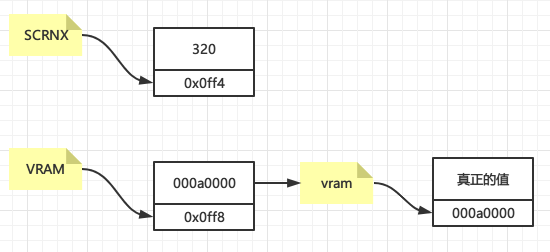
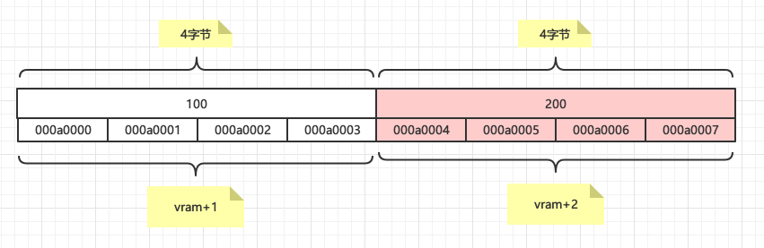
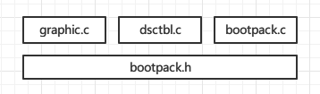
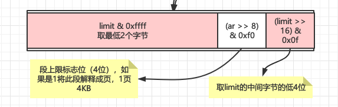
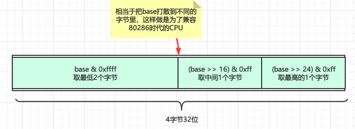
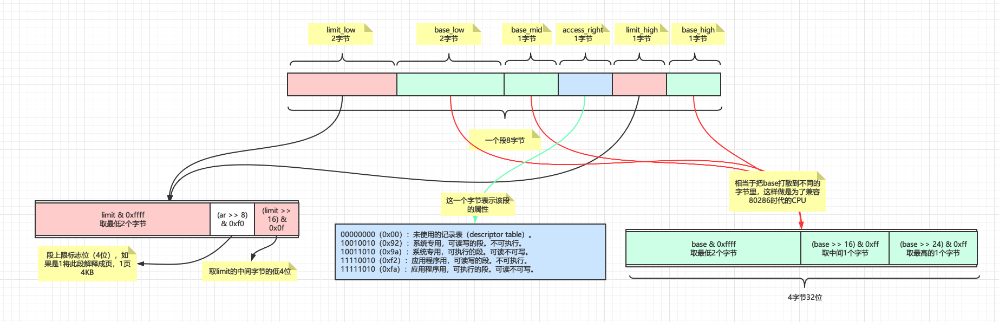
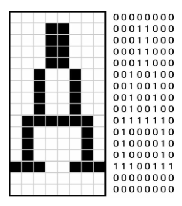
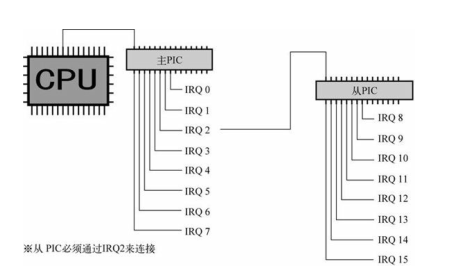
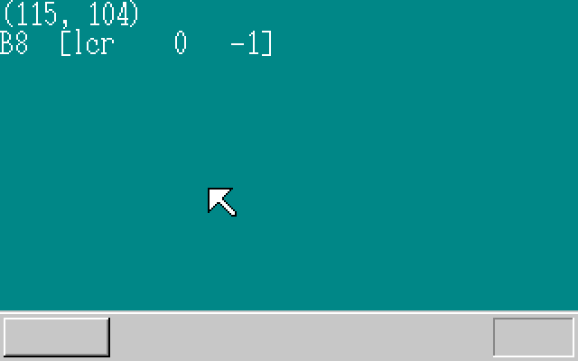

# 【30天制作操作系统系列】5~8天C语言处理鼠标键盘与中断

1~4天的时候我们已经完成了启动代码的编写并且从16位实模式转换到了32位保护模式，如果不清楚可以看看《2021-05-11【30天制作操作系统系列】1~4天从汇编到C语言》这篇，同时也从汇编过渡到了C语言，后面的处理几乎都是用C语言，5~8天作者讲的是键盘与鼠标信号的处理

简而言之，要实现的功能就是按下键盘，屏幕上要显示相应的字符，移动鼠标，鼠标指针要进行移动

## C语言基础

### 结构体

在OS启动的汇编里面定义了屏幕分辨率，在地址`0x0ff4`处写入一个十进制数320（2字节），在内存`0x0ff6`写入了一个十进制数200（2字节）

```assembly
SCRNX	EQU		0x0ff4			; 分辨率X
SCRNY	EQU		0x0ff6			; 分辨率Y
...
MOV		WORD [SCRNX],320
MOV		WORD [SCRNY],200
```

在C语言里面要取这两个值怎么取呢，地址是确定的，当然是用指针，如下

```c
short sizex,sizey;//定义值
short *scrnx,*scrny;//定义指针

//指针赋值，赋的是内存地址的值
scrnx = (short *) 0x0ff4;
scrny = (short *) 0x0ff6;

//内存地址所代表的值取出来
sizex = *scrnx;
sizey = *scrny;

// 还可以合到一起写
sizex = *( (short *) 0x0ff4 );
```

`scrnx`是地址，`*scrnx`就是该地址的值320，当然此处只有两个变量，那如果变量很多并且能够归纳为同一类，那么就可以用结构体，用`struct`定义

```c
struct SOMEINFO {
	short scrnx, scrny;
}
```

`short`是2个字节，那么`SOMEINFO`一共就是四个字节，赋值的时候如下赋值

```c
//定义值
short sizex,sizey;
//定义指针
struct SOMEINFO *info;
//指针赋值，赋变量开始位置的内存地址
info = (struct SOMEINFO *)0x0ff4;
//取出变量值
sizex = (*info).scrnx;
sizey = (*info).scrny;
```

还可以用箭头符号直接表示

```c
sizex = info->scrnx;
sizey = info->scrny
```

作者是将启动信息封装到了结构体中，下面是汇编中定义的启动信息内存地址

```assembly
; BOOT_INFO相关
CYLS	EQU		0x0ff0			; 引导扇区设置
LEDS	EQU		0x0ff1
VMODE	EQU		0x0ff2			; 关于颜色的信息
SCRNX	EQU		0x0ff4			; 分辨率X
SCRNY	EQU		0x0ff6			; 分辨率Y
VRAM	EQU		0x0ff8			; 图像缓冲区的起始地址
;.... 一系列赋值操作
MOV		BYTE [VMODE],8	; 屏幕的模式（参考C语言的引用）
MOV		WORD [SCRNX],320
MOV		WORD [SCRNY],200
MOV		DWORD [VRAM],0x	000a0000
```

C中结构体定义

```c
//结构体
struct BOOTINFO {
	char cyls, leds, vmode, reserve;
	short scrnx, scrny;
	char *vram;
};

//赋值
struct BOOTINFO *binfo = (struct BOOTINFO *) 0x0ff0;
//取值
init_screen(binfo->vram, binfo->scrnx, binfo->scrny);
```

#### 指针

这里再讲一下指针：特别要注意`VRAM`，它有点像一个嵌套指针，和`SCRNX`对比一下就知道差别了，`SCRNX`地址对应的内存里面装的是一个真正的值，而`VRAM`地址对应的内存里面装的是`000a0000`，它不是一个真正的值，它也是一个地址值，它对应的内存里面装的才是真正的值



#### 指针的赋值

以下指针的赋值表示指针`vram`往后第`i`个地址的值为`c`

```c
vram[i] = c;
```

完全等价于

```c
*(vram+i) = c;
```

或者

```c
*(i+vram) = c;
```

再或者

```c
i[vram] = c
```

本质上讲，以上几种学法没有区别，因为编译后的汇编都是一样的！一定要注意指针和数组的区别，千万不要混淆，指针和数组没有半毛钱关系！

还需要注意一点的是指针的加法中蕴含着乘法运算，比如`*(vram+1) = 100;`与`*(vram+2) = 200;`并不表示每次内存地址只是移动了一个字节，因为`vram`指针是四个字节的，所以每次都会移动四个字节，如下图所示



### 模块化

所谓模块化就是对源文件进行逻辑归类而已，把含有相同功能的一些功能放到一个单独的.c文件里面，这样方便管理，在06_day里面，作者将原来冗长的`bootpack.c`分成了以下三大块

- 处理图像处理的模块：`graphic.c`
- 初始化GDT/IDT的模块：`dsctbl.c`
- 主函数模块：`bootpack.c`

#### 头文件

当然分了模块以后，各个模块定义的函数如果要相互引用，就要将他们放到.h头文件里面，所以有个`bootpack.h`，里面除了定义啥也没有，每个模块都会导入这个头文件，这样就可以引用别的模块甚至是汇编里面定义的函数了，关系如下所示



#### 编译规则

但是分了模块以后，`.c`源文件就会增加，每增加一个都要新增一个编译规则吗？当然不是，编译规则也有通配符规则，如下，作者在Makefile里面年增加了通配符编译规则

```makefile
%.gas : %.c Makefile # 将所有.c源代码文件编译成gas汇编
	$(CC1) -o $*.gas $*.c

%.nas : %.gas Makefile # 将所有gas汇编转换成nas汇编
	$(GAS2NASK) $*.gas $*.nas

%.obj : %.nas Makefile # 将所有nas汇编编译成了obj二进制
	$(NASK) $*.nas $*.obj $*.lst
```

## GDT/IDT初始化

GDT（Global Descriptor Table）和IDT（Interrupt Descriptor Table）其实在《1~4天从汇编到C语言》已经提到过了，在16位实模式转换成32位保护模式的时候就已经初始化过GDT了，为啥此处还需要初始化一次？按照作者的意思是说模式转换要在汇编里面写GDT初始化，因为汇编不好理解，所以随便初始化了一个GDT，将真正的初始化功能留到C语言里面编写，便于理解

而IDT在此处是第一次初始化，因为模式转换的时候已经将中断关闭了，CPU不接收硬件的中断请求，所以不用初始化IDT，但是后面会涉及到键盘和鼠标的中断信号处理，所以在就此处初始化了IDT

### GDT初始化

再来回顾一下GDT的内容，GDT中每个段8字节，段里包含的内容有

- 段的大小
- 段的起始地址
- 段的管理属性：禁止写入，禁止执行，系统专用等（完全可以将某些段设置为系统专用，这样在CPU层面禁止恶意程序访问，保护了系统，这也是保护模式中**保护**二字的含义）

在C中用如下结构体表示，这个结构体刚好8字节

```c
struct SEGMENT_DESCRIPTOR {
	short limit_low, base_low;//4字节
	char base_mid, access_right;//2字节
	char limit_high, base_high;//2字节
};
```

16位的段寄存器低3位是不能使用的（存储了其他信息），只有高13位能使用，所以能表示0~8191一共8192个段，每个段是8字节，所以一共是8192 * 8字节 = 64K，如下是初始化8192个段，指针`gdt`初始化的地址是`0x00270000`，没啥特别的理由，这个地方往后64K的地址没有用而已

```c
struct SEGMENT_DESCRIPTOR *gdt = (struct SEGMENT_DESCRIPTOR *) 0x00270000;

/* GDT初始化 */
for (i = 0; i < 8192; i++) {
    set_segmdesc(gdt + i, 0, 0, 0);
}
```

具体的初始化函数`set_segmdesc`

```c
void set_segmdesc(struct SEGMENT_DESCRIPTOR *sd, unsigned int limit, int base, int ar)
{
	if (limit > 0xfffff) {
		ar |= 0x8000; /* G_bit = 1 */
		limit /= 0x1000;
	}
	sd->limit_low    = limit & 0xffff;
	sd->base_low     = base & 0xffff;
	sd->base_mid     = (base >> 16) & 0xff;
	sd->access_right = ar & 0xff;
	sd->limit_high   = ((limit >> 16) & 0x0f) | ((ar >> 8) & 0xf0);
	sd->base_high    = (base >> 24) & 0xff;
	return;
}
```

#### 段上限

既然现在是32位模式了（最大支持4G内存），那么段的地址（base）和段的上限（limit）都应该是4字节，加起来已经是8字节了，那么段的属性放哪里呢？

所以必然有个地方有取舍，这个取舍就是段上限（limit）让出一个字节来，用3字节表示段上限（limit），3个字节一共24位，拿出其中20位用来表示上限，20位能表，再拿4位用来标识单位，如果标识是1则将单位由字节解释成页，一页是4K，20位能表示的最大内存是1M，1M * 4K = 4G，这样折中就能表示4G了，所以有这个判断

```c
if (limit > 0xfffff) { //当limit大于1M的时候
    ar |= 0x8000; /* G_bit = 1 */
    limit /= 0x1000;
}
```

如下图



#### 段基址

段基址的设置就不用说了，base_low、base_mid、base_high刚好是4个字节，通过

```c
sd->base_low     = base & 0xffff;
sd->base_mid     = (base >> 16) & 0xff;
sd->base_high    = (base >> 24) & 0xff;
```

刚好将字节打散到三个变量中，那为啥要3个？这是为了兼容80286的CPU，如下图



#### 段属性

还剩下一个字节的段属性，让CPU知道这个段是OS用的还是应用程序使用的，一个标识

```properties
00000000（0x00）：未使用的记录表（descriptor table）。
10010010（0x92）：系统专用，可读写的段。不可执行。
10011010（0x9a）：系统专用，可执行的段。可读不可写。
11110010（0xf2）：应用程序用，可读写的段。不可执行。
11111010（0xfa）：应用程序用，可执行的段。可读不可写。
```

整个过程如下图



辛苦半天设置了GDT，最后别忘了将GDT的初始地址告诉CPU，即将地址注册给GTDR寄存器，这个只能用汇编来写

```assembly
_load_gdtr:		; void load_gdtr(int limit, int addr);
		MOV		AX,[ESP+4]		; limit
		MOV		[ESP+6],AX
		LGDT	[ESP+6]
		RET
```

注册给GTDR寄存器的指令就是LGDT


### IDT初始化

说到IDT（Interrupt Descriptor Table）就不得不说中断（Interrupt），甚至可以这样说，整个操作系统都是中断来驱动的（interrupt-driven）

#### 中断

首先看看中断的定义，参考：https://zh.wikipedia.org/wiki/%E4%B8%AD%E6%96%B7

> 在[计算机科学](https://zh.wikipedia.org/wiki/计算机科学)中，**中断**（英语：Interrupt）是指[处理器](https://zh.wikipedia.org/wiki/中央處理器)接收到来自硬件或软件的信号，提示发生了某个事件，应该被注意，这种情况就称为中断。
>
> 中断是用以提高计算机工作效率、增强计算机功能的一项重要技术。最初引入硬件中断，只是出于性能上的考量。如果计算机系统没有中断，则处理器与外部设备通信时，它必须在向该设备发出指令后进行忙等待（Busy waiting），反复轮询该设备是否完成了动作并返回结果。
>
> 这就造成了大量处理器周期被浪费。引入中断以后，当处理器发出设备请求后就可以立即返回以处理其他任务，而当设备完成动作后，发送中断信号给处理器，后者就可以再回过头获取处理结果。
>
> 这样，在设备进行处理的周期内，处理器可以执行其他一些有意义的工作，而只付出一些很小的切换所引发的时间代价。后来被用于CPU外部与内部紧急事件的处理、机器故障的处理、时间控制等多个方面，并产生通过软件方式进入中断处理（软中断）的概念。

顾名思义，中断就是中断CPU正在做的事情，临时给CPU安排一些活儿，比如移动一下鼠标，就会产生一个中断请求（IRQ）告诉CPU，嘿，老哥，用户移动了一下鼠标，停下手上的活儿，赶紧处理下，CPU就会将手上的活儿停下来，将寄存器里面的值暂存在内存里面，然后赶紧处理一下OS注册的鼠标移动的中断函数，处理完了之后再将寄存器的值从内存恢复，继续处理之前的事情。

这就是中断的处理，说白了有点像对事件的异步处理，不过取了个名儿：中断，CPU将寄存器的值挪到内存暂存处理中断后再读回来的操作就叫做**状态切换**，假设OS的中断函数写的不好，CPU处理中断的时候死循环了，那么对用户来说就像电脑死机了，卡住了，鼠标一动也不动。

那为啥要设计中断呢？换个思路，假设没有中断，那么就得分配一颗CPU核心区专门定时检查鼠标有没有移动，那CPU可多累呀，就像去朋友家玩，你到了朋友家敲门，朋友自然而然给你开门，不用等朋友每隔五分钟开一下门看看你有没有在门口吧？其实计算机世界中很多高大上的概念都可以用生活中平常的小事来解释！

#### 初始化

IDT初始化和GDT初始化类似，这里大致过一遍，首先是结构体定义，一条记录也是8字节

```c
struct GATE_DESCRIPTOR {
	short offset_low, selector;
	char dw_count, access_right;
	short offset_high;
};
```

一共初始化0~255共256条记录，每条记录对应了中断号码和调用函数的映射关系，注意这里只是初始化，还没有注册具体的处理函数，后面讲到鼠标和键盘的时候才去注册函数

```c
struct GATE_DESCRIPTOR    *idt = (struct GATE_DESCRIPTOR    *) 0x0026f800;
for (i = 0; i < 256; i++) {
	set_gatedesc(idt + i, 0, 0, 0);
}
```

具体的初始化过程，记住不要纠结为啥这样设，这是CPU这样规定的

```c
void set_gatedesc(struct GATE_DESCRIPTOR *gd, int offset, int selector, int ar)
{
	gd->offset_low   = offset & 0xffff;
	gd->selector     = selector;
	gd->dw_count     = (ar >> 8) & 0xff;
	gd->access_right = ar & 0xff;
	gd->offset_high  = (offset >> 16) & 0xffff;
	return;
}
```

最后别忘了注册给CPU的寄存器，依然通过汇编

```c
load_idtr(0x7ff, 0x0026f800);
```

```assembly
_load_idtr:		; void load_idtr(int limit, int addr);
		MOV		AX,[ESP+4]		; limit
		MOV		[ESP+6],AX
		LIDT	[ESP+6]
		RET
```

## 字符显示

既然本章的主题是鼠标和键盘的处理，那么点击了键盘或者滑动了鼠标界面上总得给点显示吧，在第四天的时候已经演示过了颜色的显示，原理简而言之就是在表示界面显示的内存（显存）地址上写不同的值那么界面就会展示不同的颜色，显存的内存地址范围为`0x000A0000`到`0x000BFFFF`一共131072个字节（128K），比如

```c
int i;
char *p;
p = (char *) 0Xa0000;
for (i = 0; i <= 0xffff; i++) {
	p[i] = 15;
}
```

屏幕上就会显示全白色，15表示的颜色就是白色，那如何显示字符呢？首先看一张图



左边的方框中0代表白色，1代表黑色，一行有8个方框，刚好对应右边的8位，为一个字节。一共有16行，即16个字节，那么要显示字符A，只要将这16个字节为1的位上显示不同于背景的颜色即可，看看用代码写出来是啥样

首先将这16个字节定义出来，注意在C语言里面只能用16进制来表示，把上图中的二进制转换成16进制就是下面定义的

```c
static char font_A[16] = {
    0x00, 0x18, 0x18, 0x18, 0x18, 0x24, 0x24, 0x24,
    0x24, 0x7e, 0x42, 0x42, 0x42, 0xe7, 0x00, 0x00
};
```

然后再在现存对应的位置写相应的颜色即可

```c
void putfont8(char *vram, int xsize, int x, int y, char c, char *font)
{
    int i;
    char *p, d /* data */;
    for (i = 0; i < 16; i++) {
        p = vram + (y + i) * xsize + x;
        d = font[i];
        if ((d & 0x80) != 0) { p[0] = c; }
        if ((d & 0x40) != 0) { p[1] = c; }
        if ((d & 0x20) != 0) { p[2] = c; }
        if ((d & 0x10) != 0) { p[3] = c; }
        if ((d & 0x08) != 0) { p[4] = c; }
        if ((d & 0x04) != 0) { p[5] = c; }
        if ((d & 0x02) != 0) { p[6] = c; }
        if ((d & 0x01) != 0) { p[7] = c; }
    }
    return;
}
```

`0x80`、`0x40`、`0x20`、`0x10`、`0x08`、`0x04`、`0x02`、`0x01`这几个数用16进制看不清楚，转换成二进制就清楚一些了，如下

```properties
10000000
01000000
00100000
00010000
00001000
00000100
00000010
00000001
```

即将字体数据中的每个字节拿出来从左往右判断该位上是否为1，如果为1说明该位上有数据，就在显存对应的位置上写数据。最后显示在屏幕上的效果


那么要显示所有的英文字母只需要准备相应的二进制数据即可，作者是用了一个字体文件通过编译后生成的数据，字体文件如下，此处列举了两个字符a和b，它们的地址被设计成和ASCII编码一致的，所以

```properties
char 0x61
........
........
........
........
........
.***....
....*...
.....*..
..****..
.*...*..
*....*..
*....*..
*...**..
.***.**.
........
........

char 0x62
**......
.*......
.*......
.*......
.*......
.*.**...
.**..*..
.*....*.
.*....*.
.*....*.
.*....*.
.*....*.
.**..*..
.*.**...
........
........
```

## 处理中断


### PIC

所谓PIC，即programmable interrupt controller，意思是**可编程中断控制器**，CPU只能处理一个中断，但是来自外设的硬件设备有很多，通过PIC来集中控制再发送给CPU，因此要初始化PIC



初始化PIC代码

```c
void init_pic(void)
/* PIC初始化 */
{
	io_out8(PIC0_IMR,  0xff  ); /* 禁止所有中断 */
	io_out8(PIC1_IMR,  0xff  ); /* 禁止所有中断 */

	io_out8(PIC0_ICW1, 0x11  ); /* 边缘触发模式（edge trigger mode） */
	io_out8(PIC0_ICW2, 0x20  ); /* IRQ0-7由INT20-27接收 */
	io_out8(PIC0_ICW3, 1 << 2); /* PIC1由IRQ2相连 */
	io_out8(PIC0_ICW4, 0x01  ); /* 无缓冲区模式 */

	io_out8(PIC1_ICW1, 0x11  ); /* 边缘触发模式（edge trigger mode） */
	io_out8(PIC1_ICW2, 0x28  ); /* IRQ8-15由INT28-2f接收 */
	io_out8(PIC1_ICW3, 2     ); /* PIC1由IRQ2连接 */
	io_out8(PIC1_ICW4, 0x01  ); /* 无缓冲区模式 */

	io_out8(PIC0_IMR,  0xfb  ); /* 11111011 PIC1以外全部禁止 */
	io_out8(PIC1_IMR,  0xff  ); /* 11111111 禁止所有中断 */

	return;
}
```

中断信号IRQ0~IRQ15对应的中断号范围是INT `0x20`~`0x2f`

- 键盘发出的中断信号通过IRQ1，对应的中断号是INT `0x21`
- 键盘发出的中断信号通过IRQ12，对应的中断号是INT `0x2c`

没有啥原因，这是硬件上面这么规定的

### 开启中断

由于在模式转换的时候是关闭了中断的，所以需要开启中断，让CPU接收中断的处理，在main函数里面

```c
init_gdtidt();
init_pic();
io_sti(); /* IDT/PIC的初始化已经完成，于是开放CPU的中断 */

```

### 键盘中断的处理

首先要将处理键盘中断的回调函数注册到IDT，之前我们初始化了IDT，但是没有往里面注册函数

```c
set_gatedesc(idt + 0x21, (int) asm_inthandler21, 2 * 8, AR_INTGATE32);
```

这句话的意思是将函数`asm_inthandler21`注册到IDT的第`0x21`号，这样键盘有数据了就会调用函数`asm_inthandler21`，来看看这个函数长啥样

```assembly
_asm_inthandler21:
		PUSH	ES
		PUSH	DS
		PUSHAD
		MOV		EAX,ESP
		PUSH	EAX
		MOV		AX,SS
		MOV		DS,AX
		MOV		ES,AX
		CALL	_inthandler21
		POP		EAX
		POPAD
		POP		DS
		POP		ES
		IRETD
```

此处一些列的PUSH和POP操作就是为了中断的状态切换，PUSH会把寄存器的值挪倒内存里，POP反向操作，中间会通过CALL指令调用`_inthandler21`函数，这里仔细想想应该会发现：中断处理函数要尽可能短小精悍，不要做过多复杂处理，否则会将CPU深陷入中断函数的执行中，反而原来的程序得不到执行！所以`_inthandler21`就很短小精悍，只做必要的处理！

```c
void inthandler21(int *esp)
/* 来自PS/2键盘的中断 */
{
	struct BOOTINFO *binfo = (struct BOOTINFO *) ADR_BOOTINFO;
	unsigned char data, s[4];
	io_out8(PIC0_OCW2, 0x61);	/* 通知PIC IRQ-01 已经受理完毕 */
	data = io_in8(PORT_KEYDAT);
	fifo8_put(&keyfifo, data);
	return;
}
```

其中`fifo8_put`是将键盘得到的数据直接写入到缓冲区就完事了，为此，作者专门实现了一个FIFO缓冲区，详情见`fifo.c`

那么缓冲区的数据在哪里处理呢？在主函数的死循环里，如下

```c
for (;;) {
		io_cli();//关中断
        //缓冲区没数据的时候
		if (fifo8_status(&keyfifo) == 0) {
			io_stihlt();//开中断并且HLT住CPU
        //缓冲区有数据的时候    
		} else {
            //对缓冲区的数据做处理
			i = fifo8_get(&keyfifo);
            io_sti();
            sprintf(s, "%02X", i);
            boxfill8(binfo->vram, binfo->scrnx, COL8_008484,  0, 16, 15, 31);
            putfonts8_asc(binfo->vram, binfo->scrnx, 0, 16, COL8_FFFFFF, s);
		}
	}
```

### 鼠标中断的处理

鼠标的处理和键盘类似，首先依然要将处理鼠标中断的回调函数注册到IDT

```c
set_gatedesc(idt + 0x2c, (int) asm_inthandler2c, 2 * 8, AR_INTGATE32);
```

这句话的意思是将函数`asm_inthandler2c`注册到IDT的第`0x2c`号，不过鼠标有点特殊，因为鼠标相比较键盘而言是比较新的硬件了，所以需要先激活一下鼠标控制电路

```c
void init_keyboard(void)
{
	/* 初始化键盘控制电路 */
	wait_KBC_sendready();
	io_out8(PORT_KEYCMD, KEYCMD_WRITE_MODE);
	wait_KBC_sendready();
	io_out8(PORT_KEYDAT, KBC_MODE);//初始化鼠标控制电路
	return;
}

```

然后鼠标收到激活指令后会发送一个中断处理，数据是`0xfa`，表示鼠标已就绪

```c
void enable_mouse(struct MOUSE_DEC *mdec){
	/* 鼠标有效 */
	wait_KBC_sendready();
	io_out8(PORT_KEYCMD, KEYCMD_SENDTO_MOUSE);
	wait_KBC_sendready();
	io_out8(PORT_KEYDAT, MOUSECMD_ENABLE);
	/* 顺利的话，ACK(0xfa)会被送过来 */
	mdec->phase = 0; /* 等待0xfa的阶段 */    
	return;
}
```

然后看一下鼠标回调函数`asm_inthandler2c`，和键盘处理如出一辙，肯定也需要状态切换的

```assembly
_asm_inthandler2c:
		PUSH	ES
		PUSH	DS
		PUSHAD
		MOV		EAX,ESP
		PUSH	EAX
		MOV		AX,SS
		MOV		DS,AX
		MOV		ES,AX
		CALL	_inthandler2c
		POP		EAX
		POPAD
		POP		DS
		POP		ES
		IRETD
```

`_inthandler2c`函数

```c
void inthandler2c(int *esp)
/* 来自PS/2鼠标的中断 */
{
	unsigned char data;
	io_out8(PIC1_OCW2, 0x64);	/* 通知PIC IRQ-12 已经受理完毕 */
	io_out8(PIC0_OCW2, 0x62);	/* 通知PIC IRQ-02 已经受理完毕 */
	data = io_in8(PORT_KEYDAT);
	fifo8_put(&mousefifo, data);
	return;
}
```

和键盘处理如出一辙，直接将数据塞进缓冲区即可

```c
for (;;) {
		io_cli();//关中断
        //缓冲区没数据的时候
		if (fifo8_status(&keyfifo) == 0) {
			io_stihlt();//开中断并且HLT住CPU
        //缓冲区有数据的时候    
		} else {
            //对缓冲区的数据做处理
			i = fifo8_get(&keyfifo);
            io_sti();
            sprintf(s, "%02X", i);
            boxfill8(binfo->vram, binfo->scrnx, COL8_008484,  0, 16, 15, 31);
            putfonts8_asc(binfo->vram, binfo->scrnx, 0, 16, COL8_FFFFFF, s);
		}
	}
```

最后对鼠标的处理还是比较麻烦的，鼠标的数据是连续的，每次是3个字节一组，所以要等3个字节凑齐了在做处理，而且要忽略到鼠标第一次发来的中断信息`0xfa`，那只是表明鼠标已就绪而已，处理过程大概如下

```c
for (;;) {
    io_cli();
    if (fifo8_status(&mousefifo) == 0) {
        io_stihlt();
    } else {
        i = fifo8_get(&mousefifo);
        io_sti();
        if (mouse_decode(&mdec, i) != 0) {
            /* 3字节都凑齐了，所以把它们显示出来*/
            sprintf(s, "[lcr %4d %4d]", mdec.x, mdec.y);
            if ((mdec.btn & 0x01) != 0) {
                s[1] = 'L';
            }
            if ((mdec.btn & 0x02) != 0) {
                s[3] = 'R';
            }
            if ((mdec.btn & 0x04) != 0) {
                s[2] = 'C';
            }
            boxfill8(binfo->vram, binfo->scrnx, COL8_008484, 32, 16, 32 + 15 * 8 - 1, 31);
            putfonts8_asc(binfo->vram, binfo->scrnx, 32, 16, COL8_FFFFFF, s);
            /* 鼠标指针的移动 */
            boxfill8(binfo->vram, binfo->scrnx, COL8_008484, mx, my, mx + 15, my + 15); /* 隐藏鼠标 */
            mx += mdec.x;
            my += mdec.y;
            if (mx < 0) {
                mx = 0;
            }
            if (my < 0) {
                my = 0;
            }
            if (mx > binfo->scrnx - 16) {
                mx = binfo->scrnx - 16;
            }
            if (my > binfo->scrny - 16) {
                my = binfo->scrny - 16;
            }
            sprintf(s, "(%3d, %3d)", mx, my);
            boxfill8(binfo->vram, binfo->scrnx, COL8_008484, 0, 0, 79, 15); /* 隐藏坐标 */
            putfonts8_asc(binfo->vram, binfo->scrnx, 0, 0, COL8_FFFFFF, s); /* 显示坐标 */
            putblock8_8(binfo->vram, binfo->scrnx, 16, 16, mx, my, mcursor, 16); /* 描画鼠标 */
        }
    }
}

int mouse_decode(struct MOUSE_DEC *mdec, unsigned char dat){
    if (mdec->phase == 0) {
        /* 等待鼠标的0xfa的阶段 */
        if (dat == 0xfa) {
            mdec->phase = 1;
        }        
        return 0;
    }
    if (mdec->phase == 1) {
        /* 等待鼠标第一字节的阶段 */
        mdec->buf[0] = dat;
        mdec->phase = 2;
        return 0;
    }
    if (mdec->phase == 2) {
        /* 等待鼠标第二字节的阶段 */
        mdec->buf[1] = dat;
        mdec->phase = 3;
        return 0;
    }
    if (mdec->phase == 3) {
        /* 等待鼠标第二字节的阶段 */
        mdec->buf[2] = dat;
        mdec->phase = 1;
        mdec->btn = mdec->buf[0] & 0x07;
        mdec->x = mdec->buf[1];
        mdec->y = mdec->buf[2];
        if ((mdec->buf[0] & 0x10) != 0) {
            mdec->x |= 0xffffff00;
        }
        if ((mdec->buf[0] & 0x20) != 0) {
            mdec->y |= 0xffffff00;
        }     
        /* 鼠标的y方向与画面符号相反 */   
        mdec->y = - mdec->y; 
        return 1;
    }
    /* 应该不可能到这里来 */
    return -1; 
}
	
```
运行效果



所有源码均在：https://github.com/scriptwang/30DaysMakeOS