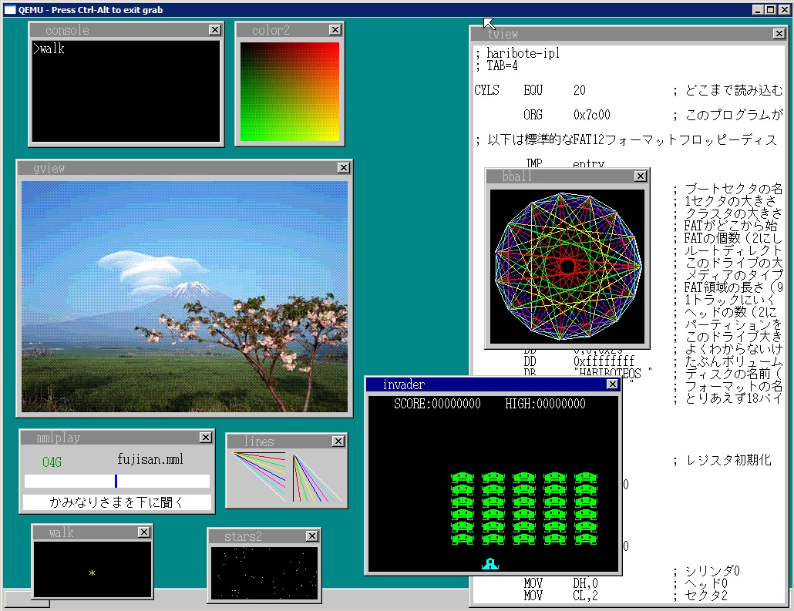

## 笔记

- [2021-05-11【30天制作操作系统系列】1~4天从汇编到C语言](./Note/2021-05-11【30天制作操作系统系列】1~4天从汇编到C语言.md)

---

书本实现了一个名为OSASK的只有80KB的简单操作系统，效果图如下

## projects
详细的源码文件，包含每个步骤，注释是日文的

## projects1
每天最后一个章节的源码文件，注释是中文的

## 书本各章内容概要

### 第一周（第1天 ～ 第7天）

一开始首先要考虑怎么来写一个“只要一通电就能运行的程序”。 这部分用C语言写
起来有些困难， 所以主要还是用汇编语言来写。
这步完成之后， 下一步就要写一个从磁盘读取操作系统的程序。 这时即便打开电脑
电源， 它也不会自动地将操作系统全部都读进来， 它只能读取磁盘上最开始的512
字节的内容， 所以我们要编写剩余部分的载入程序。 这个程序也要用汇编语言编
写。
一旦完成了这一步， 以后的程序就可以用C语言来编写了。 我们就尽快使用C语言
来学习开发显示画面的程序。 同时， 我们也能慢慢熟悉C语言语法。 这个时候我们
好像在做自己想做的事， 但事实上我们还没有自由操纵C语言。
接下来， 为了实现“移动鼠标”这一雄心， 我们要对CPU进行细致的设定， 并掌握中
断处理程序的写法。 从全书总体看来， 这一部分是水平相当高的部分， 笔者也觉得
放在这里有些不妥， 但从本书条理上讲， 这些内容必须放在这里， 所以只好请大家
忍耐一下了。 在这里， CPU的规格以及电脑复杂的规格都会给我们带来各种各样的
麻烦。 而且开发语言既有C语言， 又有汇编语言， 这又给我们造成了更大的混乱。
这个时候我们一点儿也不会觉得这是在做自己想做的事， 怎么看都像是在“受人摆
布”。
渡过这个痛苦的时期， 第一周就该结束了。

### 第二周（第8天 ～ 第14天）

一周的苦战还是很有意义的， 回头一看， 我们就会发现自己还是斩获颇丰的。 这时
我们已经基本掌握了C语言的语法， 连汇编语言的水平也能达到本书的要求了。
所以现在我们就可以着手开发像样的操作系统了。 但是这一次我们又要为算法头痛
了。 即使掌握了编程语言的语法， 如果不懂得好的算法的话， 也还是不能开发出来
自己想要的操作系统。 所以这一周我们就边学习算法边慢慢地开发操作系统。 不过
到了这一阶段， 我们就能感觉到基本上不会再受技术问题限制了。

### 第三周（第15天 ～ 第21天）

现在我们的技术已经相当厉害了， 可以随心所欲地开发自己的操作系统了。 首先是
要支持多任务， 然后是开发命令行窗口， 之后就可以着手开发应用程序了。 到本周
结束时， 就算还不够完备， 我们也能拿出一个可以称之为操作系统的软件了。

### 第四周（第22天 ～ 第28天）

在这个阶段， 我们可以尽情地给操作系统增加各种各样的功能， 同时还可以开发出
大量像模像样的应用程序来。 这个阶段我们已经能做得很好了， 这可能也是我们最
高兴的时期。 这部分要讲解的内容很少， 笔者也不用再煞费苦心地去写那些文字说
明了， 可以把精力都集中在编程上（笑） 。 对了， 说起文字才想起来， 正好在这个
时期可以让我们的操作系统显示文字了。